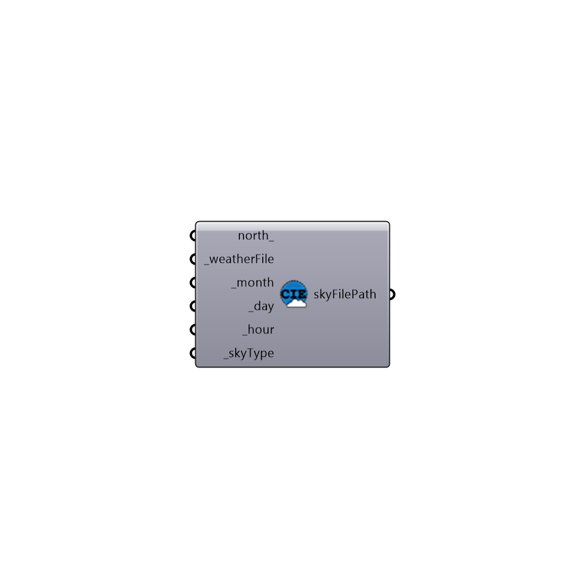

##  Generate Standard CIE Sky

Genrate Standard CIE Sky
 -
 

#### Inputs
* ##### north [Optional]
Input a vector to be used as a true North direction for the sun path or a number between 0 and 360 that represents the degrees off from the y-axis to make North.  The default North direction is set to the Y-axis (0 degrees).
* ##### weatherFile [Required]
epw file location on your system as a string
* ##### month [Required]
Input a number to indicate month
* ##### day [Required]
Input a number to indicate day
* ##### hour [Required]
Input a number to indicate hour
* ##### skyType [Required]
CIE Sky Type [0] Sunny with sun, [1] sunny without sun, [2] intermediate with sun, [3] intermediate without sun, [4] cloudy sky, [5] uniform sky

#### Outputs
* ##### skyFilePath
Sky file location on the local drive

[Check Hydra Example Files for Generate Standard CIE Sky](https://hydrashare.github.io/hydra/index.html?keywords=Honeybee_Generate Standard CIE Sky)