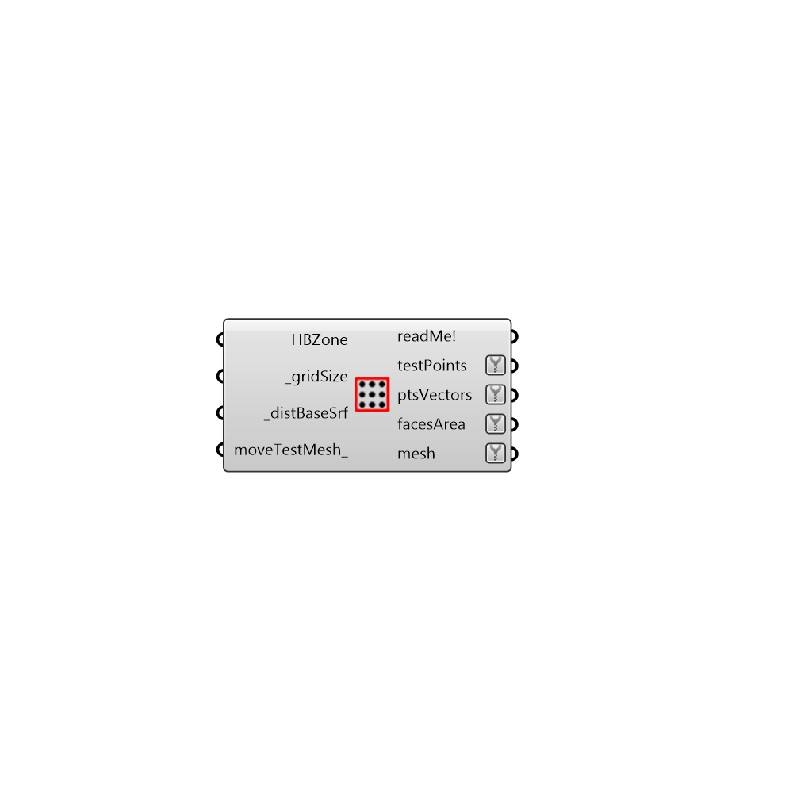

##  Generate Zone Test Points - [[source code]](https://github.com/ladybug-tools/honeybee-legacy/tree/master/src/Honeybee_Generate%20Zone%20Test%20Points.py)

Genrate Test Points for all Floor Surfaces in Honeybee Zone
 -
 

#### Inputs
* ##### HBZone [Required]
HBZone; Test points will be generated for every floor surface inside zone
* ##### gridSize [Required]
Size of the test grid
* ##### distBaseSrf [Required]
Distance from base surface
* ##### moveTestMesh [Optional]
Set to False if you want test mesh not to move. Default is True.

#### Outputs
* ##### readMe!
...
* ##### testPoints
Test points
* ##### ptsVectors
Vectors
* ##### facesArea
Script output facesArea.
* ##### mesh
Analysis mesh

[Check Hydra Example Files for Generate Zone Test Points](https://hydrashare.github.io/hydra/index.html?keywords=Honeybee_Generate Zone Test Points)