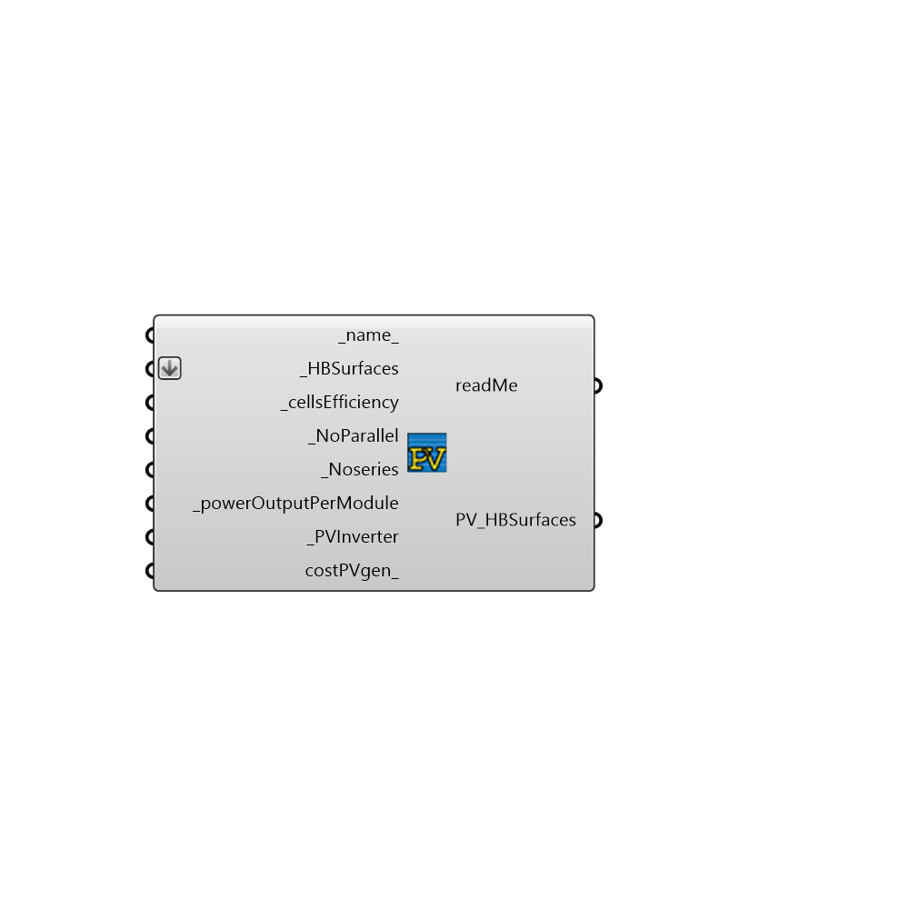

##  Generator_PV - [[source code]](https://github.com/mostaphaRoudsari/honeybee/tree/master/src/Honeybee_Generator_PV.py)

#### Inputs
* ##### name [Default]
An optional input, a name or a list of names of PV generators which correspond sequentially to the Honeybee surfaces in _HBSurfaces. Without this input PV generators will be assigned default names.
* ##### HBSurfaces [Required]
A Honeybee/context surface or a list of Honeybee/context surfaces to which one Photovolatic generator will be mounted on each surface.
* ##### cellsEfficiency [Required]
A float or a list of floats that sequentially detail the efficiency of the Photovoltaic generator cells on each Honeybee surface in _HBSurfaces as a fraction. e.g the first float corresponds to the first Honeybee surface. If only one float is given this value will be used for all other PV generators.
* ##### integrationMode [Required]
EnergyPlus allows for different ways of integrating with other EnergyPlus heat transfer surfaces and models and calculating Photovoltaic cell temperature. This field is a integer or a list of integers sequentially to _HBSurfaces between 1 and 6 that defines the heat transfer integration mode used in the calculations as one of the following options. Decoupled a value of 1, DecoupledUllebergDynamic a value of 2, IntegratedSurfaceOutsideFace a value of 3, IntegratedTranspiredCollector a value of 4, IntegratedExteriorVentedCavity a value of 5, PhotovoltaicThermalSolarCollector a value of 6. If only one integer is given this value will be used for all other PV generators. More information about each mode can be found on page 1767 and 1768 of the Energyplus Input Output reference.
* ##### NoParallel [Required]
A integer or a list of integers that sequentially correspond to each Honeybee surface in _HBSurfaces. These integers define the series-wired strings of PV modules that are in parallel to form the PV generator on each Honeybee surface. The product of this field and the next field will equal the total number of modules in the PV generator on each Honeybee surface. If only one integer is given this value will be used for all other PV generators.
* ##### Noseries [Required]
A integer or a list of integers that sequentially correspond to each Honeybee surface in _HBSurfaces.  These integers define the number of modules wired in series (on each string) to form the PV generator on each Honeybee surface in _HBSurfaces. The product of this field and the previous field will equal the total number of modules in the PV generator on each Honeybee surface. If only one integer is given this value will be used for all other PV generators.
* ##### costPVPerModule [Required]
A float or a list of floats which give the cost of each PV generator on each Honeybee surface in _HBSurfaces in whatever currency the user wishes - (This is the sum of the cost of each PV module on the surface in question, as a PV generator is made up of one or several PV modules). If only one float is given this value will be used for all other PV generators.
* ##### powerOutputPerModule [Required]
A float or a list of floats which give the rated power output of each PV generator on each Honeybee surface in _HBSurfaces in watts. (This is the sum of the rated power output of each PV module on the surface in question, as a PV generator is made up of one or several PV modules). If only one float is given this value will be used for all other PV generators.
* ##### PVInverter [Required]
The inverter servicing all the PV generators in this component - to assign an inverter connect the HB_inverter here from the Honeybee inverter component
* ##### sandiaMode [Optional]
Input just ONE Sandria data set as a panel here. Examples can be seen in C:\EnergyPlusV8-4-0\MacroDataSet\SandiaPVdata

#### Outputs
* ##### readMe
Script variable PVgen
* ##### PV_HBSurfaces
The Honeybee/context surfaces that have been modified by this component - these surfaces now contain PV generators to run in an EnergyPlus simulation. To do so you need to add them to a Honeybee generation system first - connect them to the PV_HBSurfaces input of a Honeybee_generationsystem component.

[Check Hydra Example Files for Generator_PV](https://hydrashare.github.io/hydra/index.html?keywords=Honeybee_Generator_PV)