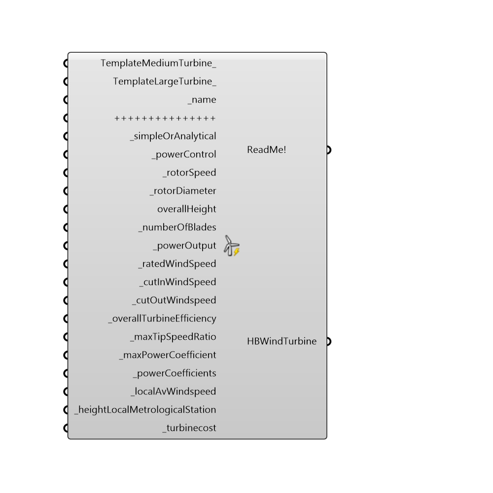

##  Generator_Wind_Horizontialaxis - [[source code]](https://github.com/mostaphaRoudsari/honeybee/tree/master/src/Honeybee_Generator_Wind_Horizontialaxis.py)

#### Inputs
* ##### TemplateMediumTurbine [Optional]
If set to True a medium sized turbine will be created with pre-set values, the turbines values can be viewed from the ReadMe! output. Template values can be changed for each input below by entering a value for each input. Otherwise if no input is given template values will be used for each input.
* ##### TemplateLargeTurbine [Optional]
If set to True a large sized turbine will be created with pre-set values, the turbines values can be viewed from the ReadMe! output. Template values can be changed for each input below by entering a value for each input. Otherwise if no input is given template values will be used for each input.
* ##### name [Required]
The name for this wind turbine
* ##### simpleOrAnalytical [Required]
An integer of 1 or 2 that defines whether the wind turbine is simple or analytical,
 the default is the simple model with a coefficient of 0.40 - The simple model uses one maximum power coefficient as a maximum fraction of power extraction from ambient wind.
 While the analytical model uses 6 with the default analytical coefficents (used only if turbine switched to analytical) being 0.5176,116,0.4,0,5 and 21 details of each model can be seen at http://bigladdersoftware.com/epx/docs/8-3/input-output-reference/group-electric-load-center.html#field-maximum-power-coefficient
 and http://bigladdersoftware.com/epx/docs/8-3/input-output-reference/group-electric-load-center.html#field-power-coefficient-parameter respectively.
* ##### powerControl [Required]
This field is the type of rotor control for the wind turbine. This protects the system against the overloading for a system with no speed or pitch control and also to maximize the energy yield for the system. Four different control types are classified in the literature: 
 1-Fixed Speed Fixed Pitch (FSFP),
 2-Fixed Speed Variable Pitch (FSVP),
 3-Variable Speed Fixed Pitch (VSFP), and
 4-Variable Speed Variable Pitch (VSVP).
 enter an integer input of 1,2,3 and 4 to select these options respectively.
* ##### rotorSpeed [Required]
This field is the maximum rotational speed of the rotor at the rated power of the wind turbine in rev/min (revolution per minute). It is used to determine the tip speed ratio of the rotor and relative flow velocity incident on a single blade of the VAWT systems.
* ##### rotorDiameter [Required]
This field is the diameter of the rotor (in meters ). Note that this field is not the height of the blade, but the diameter of the perpendicular circle from the vertical pole in the VAWT systems. It determines the swept area of the rotor of the HAWT systems and the chordal velocity of the VAWT systems.
* ##### overallHeight []
This field is the height of the hub of the HAWT system, or of the pole of the VAWT system (in meters). It is necessary to estimate local air density and the wind speed at this particular height where the wind turbine system is installed.
* ##### numberOfBlades [Required]
This field is the number of blades of the wind turbine. The azimuth angle of the rotor of the VAWT system is determined by dividing 360 degree by this field so that the model determines the chordal velocity component and the normal velocity component of the system. The default value is 3.
* ##### powerOutput [Required]
This field is the nominal power output of the wind turbine system at the rated wind speed (in W or Btu/hr). Note that the maximum power of the system should be entered with no control, i.e. FSFP control type, can physically produce. Manufacturer data sometimes describes this as “peak power” or “rated capacity”. If the local wind speed is greater than the rated wind speed, the model assumes constant power output of this field.
* ##### ratedWindSpeed [Required]
This field is the wind speed that the wind turbine system indicates the peak in the power curve (in m/s ). The system produces the maximum power at this speed and the speed of the rotor is managed based on this wind speed.
* ##### cutInWindSpeed [Required]
This field is the lowest wind speed where the wind turbine system can be operated (in m/s). No power generation is achieved as long as the ambient wind speed is lower than this speed
* ##### cutOutWindspeed [Required]
This field is the greatest wind speed (in m/s). When the wind speed exceeds this value, the wind turbine system needs to be stopped because of inefficiencies in the system. All systems that have either pitch or speed control must be stopped when the ambient wind speed exceeds this speed. Note that the user should input a wind speed above which physical damage to the system might be caused in the case of a FSFP system. It appears as “extreme/survival/design wind speed” in the literature. The system will be turned off when the ambient wind speed is over this speed.
* ##### overallTurbineEfficiency [Required]
This field is the overall system efficiency of the wind turbine system. It includes all the conversion losses as well as transient losses during the dynamic control when the ambient wind speed is between the rated wind speed and cut-out wind speed (see previous fields). The user also has the ability to specify delivery losses from the system to the local area. If the user does not enter a fraction, the model assumes the default value of 0.835. Note that the fraction must be between zero and one.
* ##### maxTipSpeedRatio [Required]
This field is the maximum tip speed ratio between the rotor velocity and ambient wind velocity. The rotor speed varies with this ratio to maximize the power output when the rotor control types are variable speed ones. This field allows the user to adjust the power output from the particular system or to find the optimal tip speed ratio of the system. Optimal tip speed ratio is dependent on the number of blades. It is typically about 6, 5, and 3 for two-bladed, three-bladed, and four-bladed rotor, respectively. For the vertical axis wind turbine, it is smaller than horizontal axis wind turbine, and varies with the chord area. 
* ##### maxPowerCoefficient [Required]
Used only with the simple model, this is the maximum fraction of power extraction possible from the ambient wind. This value can be calculated from the power curve published in most manufacturers' specifications by using the kinetic energy equation as
 Cp = P/0.5*ρ*A*V^3  where: P = power production at the rated wind speed [W], ρ = density of air [kg/m3], A = swept area of rotor [m2], V = rated wind speed [m/s], Cp = power coefficient
* ##### powerCoefficients [Required]
Used only with the analytical model - Use a grasshopper panel set to multiline data to specify the 6 power coefficients - If none are specified the defaults outlined in the Energy Plus documentation will be used. More information can be found at: http://bigladdersoftware.com/epx/docs/8-2/input-output-reference/group-electric-load-center.html#field-power-coefficient-parameter
* ##### localAvWindspeed [Required]
This is the local annual average wind speed that represents a representative wind profile at the location of the system (in m/s ). It is used to factor the difference in wind speed between the weather file wind data and the locally measured wind data so that the model minimizes uncertainties caused by improper wind data at the particular location. Considerable differences between the weather file wind data and the local wind data typically appear so it is important to consider this carefully in order to use accurate local wind data in the simulation. The model internally determines a multiplier and it is multiplied by the weather file wind data adjusted at the height of the system
* ##### heightLocalMetrologicalStation [Required]
This is the height that the local wind speed is measured (in meters ). The annual average wind speed (see previous field) input by the user is internally recalculated by existing EnergyPlus functions at the height of the local station. This modified wind speed is then factored and applied to the weather file wind data. The minimum and default values are zero and 50 meters.
* ##### turbinecost [Required]
The cost of the turbine

#### Outputs
* ##### ReadMe!
The execution information, as output and error streams
* ##### HBWindTurbine
A Honeybee wind turbine. To run this in an EnergyPlus system you must first add it to a Honeybee generation system - to do so connect this output to the HB_generationobjects input of the Honeybee_generationsystem component

[Check Hydra Example Files for Generator_Wind_Horizontialaxis](https://hydrashare.github.io/hydra/index.html?keywords=Honeybee_Generator_Wind_Horizontialaxis)