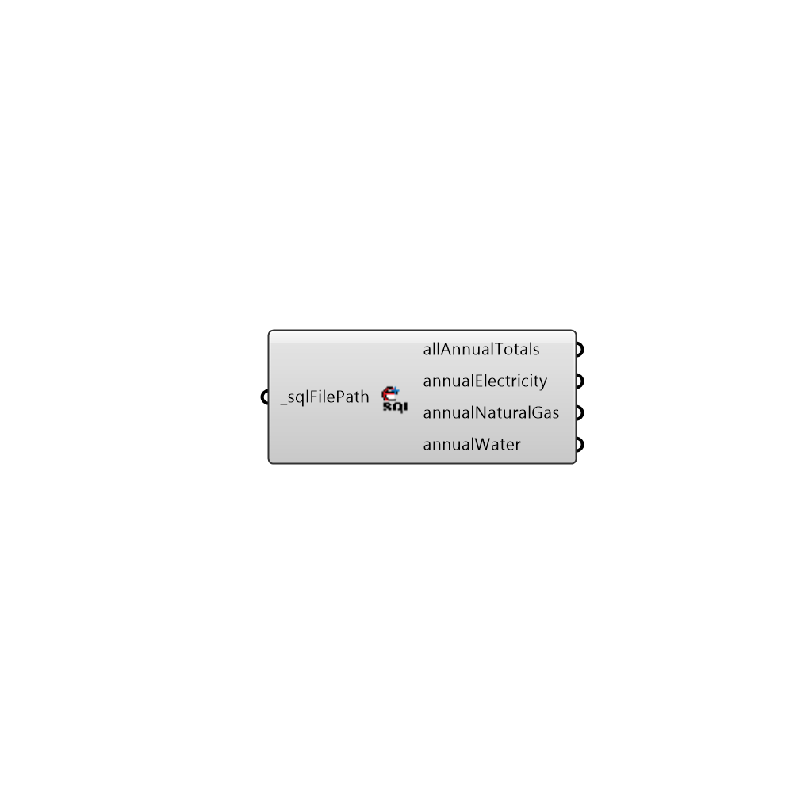

##  Get Annual SQL Data

Export Honeybee Objects to OpenStudio
 -
 

#### Inputs
* ##### sqlFilePath [Required]
Script variable Python

#### Outputs
* ##### allAnnualTotals
Script variable getAnnualSQLData
* ##### annualElectricity
Script variable Python
* ##### annualNaturalGas
Script variable analyzeSQL
* ##### annualWater
Script variable getAnnualSQLData

[Check Hydra Example Files for Get Annual SQL Data](https://hydrashare.github.io/hydra/index.html?keywords=Honeybee_Get Annual SQL Data)