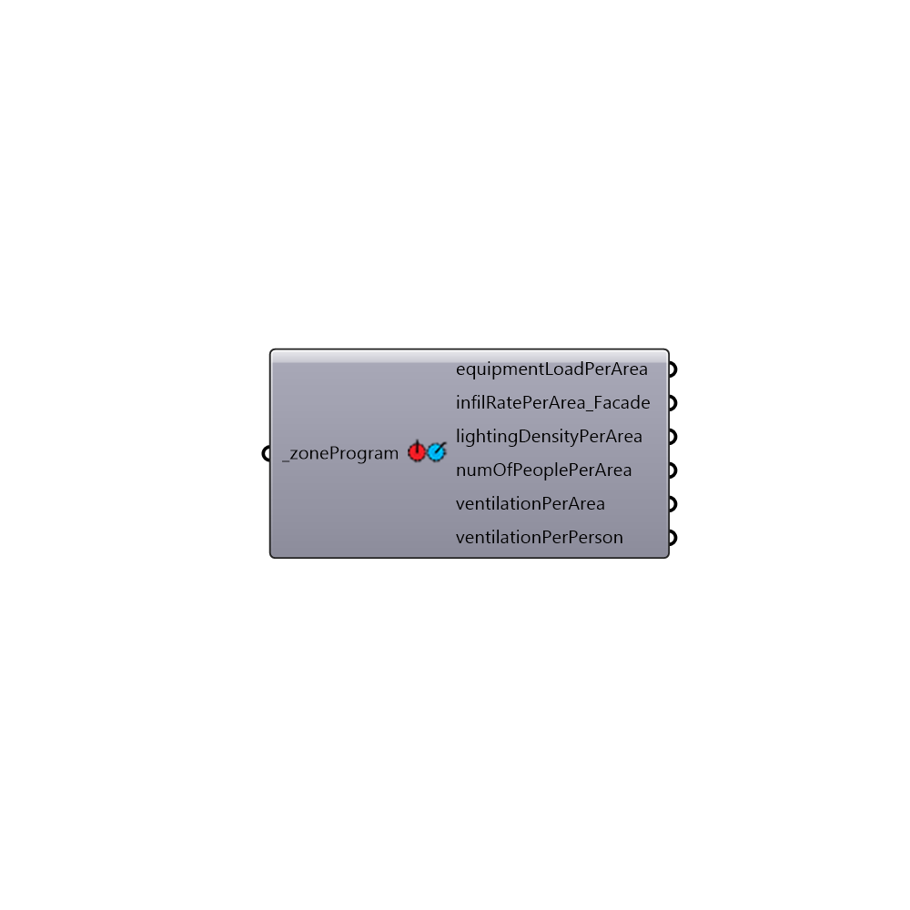

##  Get EnergyPlus Loads - [[source code]](https://github.com/mostaphaRoudsari/honeybee/tree/master/src/Honeybee_Get%20EnergyPlus%20Loads.py)

Look up loads for an specific bldgProgram and zoneProgram
 -
 

#### Inputs
* ##### zoneProgram [Required]
Script input _zoneProgram.

#### Outputs
* ##### equipmentLoadPerArea
equipmentLoadPerArea
* ##### infiltrationRatePerArea
infiltrationRatePerArea
* ##### lightingDensityPerArea
lightingDensityPerArea
* ##### numOfPeoplePerArea
numOfPeoplePerArea
* ##### ventilationPerArea
ventilationPerArea
* ##### ventilationPerPerson
ventilationPerPerson

[Check Hydra Example Files for Get EnergyPlus Loads](https://hydrashare.github.io/hydra/index.html?keywords=Honeybee_Get EnergyPlus Loads)