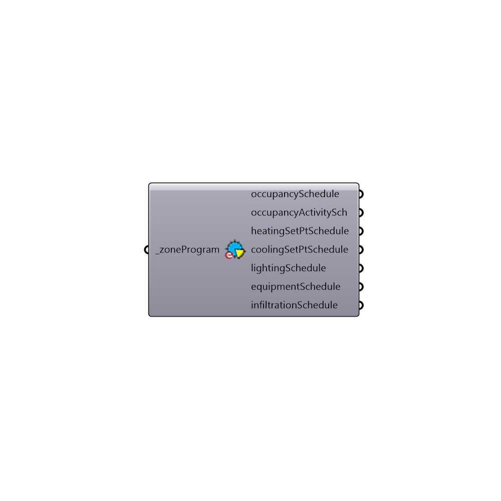

##  Get EnergyPlus Schedules

Look up schedules for an specific bldgProgram and zoneProgram
 -
 

#### Inputs
* ##### zoneProgram [Required]
Script input _zoneProgram.

#### Outputs
* ##### occupancySchedule
occupancySchedule
* ##### occupancyActivitySch
Script variable LookupSchedules
* ##### heatingSetPtSchedule
heatingSetPtSchedule
* ##### coolingSetPtSchedule
coolingSetPtSchedule
* ##### lightingSchedule
lightingSchedule
* ##### equipmentSchedule
equipmentSchedule
* ##### infiltrationSchedule
infiltrationSchedule

[Check Hydra Example Files for Get EnergyPlus Schedules](https://hydrashare.github.io/hydra/index.html?keywords=Honeybee_Get EnergyPlus Schedules)