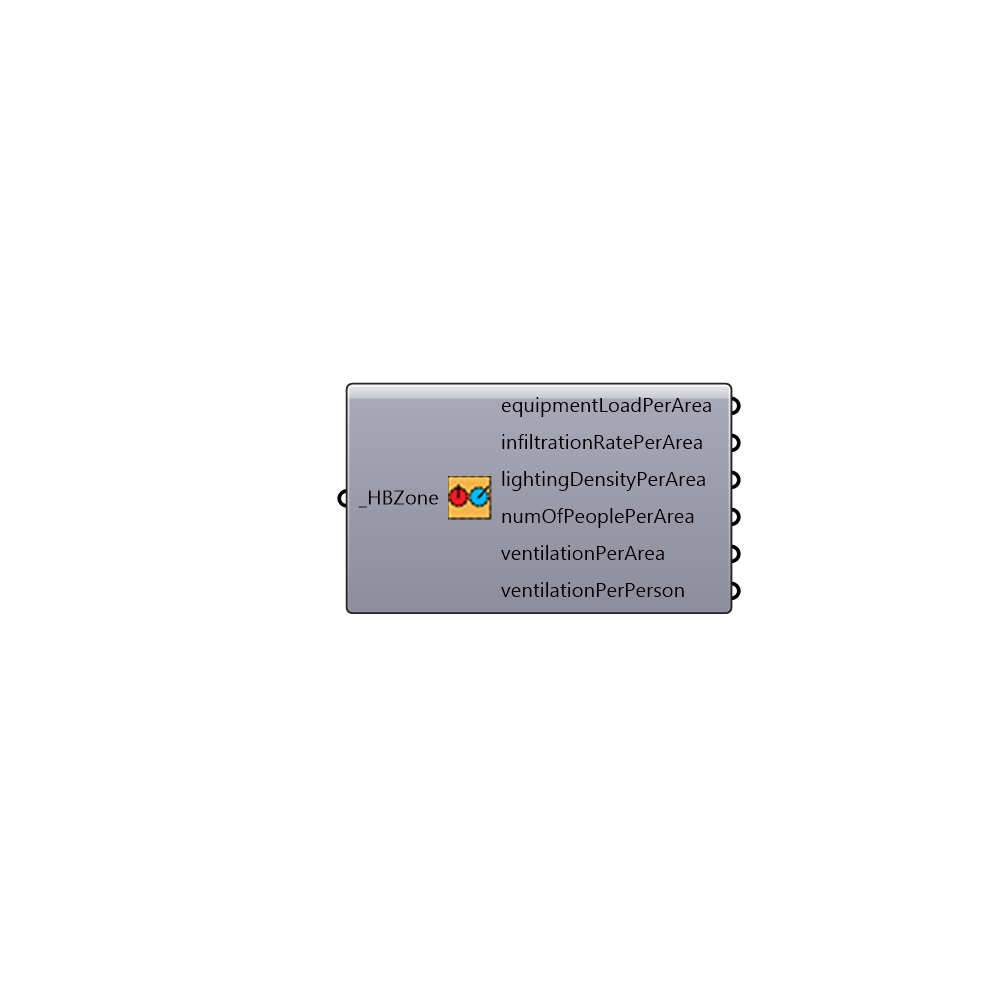

##  Get Zone EnergyPlus Loads

Look up loads for a Honeybee Zone
 -
 

#### Inputs
* ##### HBZone [Required]
Script input _zoneProgram.

#### Outputs
* ##### equipmentLoadPerArea
Per m^2
* ##### infiltrationRatePerArea
Per m^2
* ##### lightingDensityPerArea
Per m^2
* ##### numOfPeoplePerArea
Per m^2
* ##### ventilationPerArea
m3/s.m2
* ##### ventilationPerPerson
m3/s.person

[Check Hydra Example Files for Get Zone EnergyPlus Loads](https://hydrashare.github.io/hydra/index.html?keywords=Honeybee_Get Zone EnergyPlus Loads)