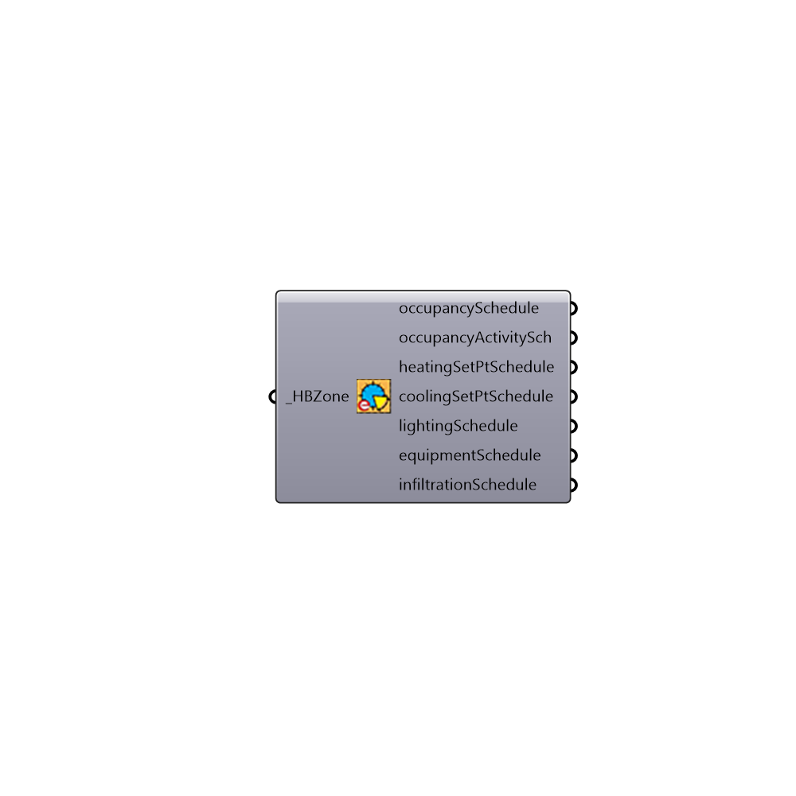

##  Get Zone EnergyPlus Schedules - [[source code]](https://github.com/mostaphaRoudsari/honeybee/tree/master/src/Honeybee_Get%20Zone%20EnergyPlus%20Schedules.py)

Look up schedules for a Honeybee Zone
 -
 

#### Inputs
* ##### HBZone [Required]
Honeybee zone

#### Outputs
* ##### occupancySchedule
occupancySchedule
* ##### occupancyActivitySch
Script variable LookupSchedules
* ##### heatingSetPtSchedule
heatingSetPtSchedule
* ##### coolingSetPtSchedule
coolingSetPtSchedule
* ##### lightingSchedule
lightingSchedule
* ##### equipmentSchedule
equipmentSchedule
* ##### infiltrationSchedule
infiltrationSchedule

[Check Hydra Example Files for Get Zone EnergyPlus Schedules](https://hydrashare.github.io/hydra/index.html?keywords=Honeybee_Get Zone EnergyPlus Schedules)