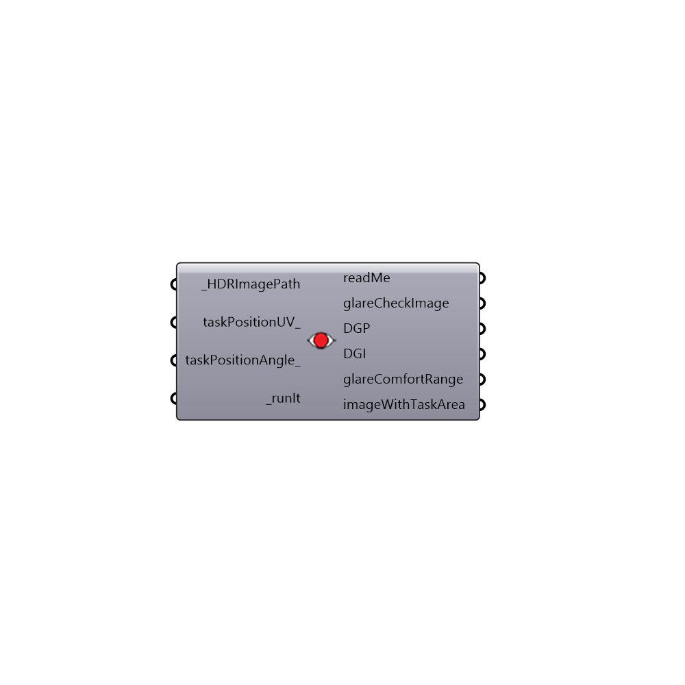

##  Glare Analysis - [[source code]](https://github.com/mostaphaRoudsari/honeybee/tree/master/src/Honeybee_Glare%20Analysis.py)

Glare Analysis
 This component is using evalglare for glare calculations. Evalgalare is developed by J. Wienold at Fraunhofer ISE.
 http://www.ise.fraunhofer.de/en/
 Check this link for more information about glare analysis. Thanks to Christoph Reinhart, Shelby Doyle, J Alstan Jakubiec and Rashida Mogri.
 http://web.mit.edu/tito_/www/Projects/Glare/GlareRecommendationsForPractice.html
 -
 

#### Inputs
* ##### HDRImagePath [Required]
Path to an HDR image file
* ##### taskPositionUV [Optional]
Task position in x and y coordinates
* ##### taskPositionAngle [Optional]
Task position opening angle in degrees
* ##### runIt [Required]
Set to True to run the analysis

#### Outputs
* ##### readMe
...
* ##### glareCheckImage
Path to HDR image of the glare study
* ##### DGP
Daylight glare probability. 
* ##### DGI
Daylight glare index
* ##### glareComfortRange
Comfort Ranges. Imperceptible Glare [0.35 > DGP], Perceptible Glare [0.4 > DGP >= 0.35], Disturbing Glare [0.45 > DGP >= 0.4], Intolerable Glare [DGP >= 0.45] 
* ##### imageWithTaskArea
Path to HDR image with task area marked with blue circle

[Check Hydra Example Files for Glare Analysis](https://hydrashare.github.io/hydra/index.html?keywords=Honeybee_Glare Analysis)