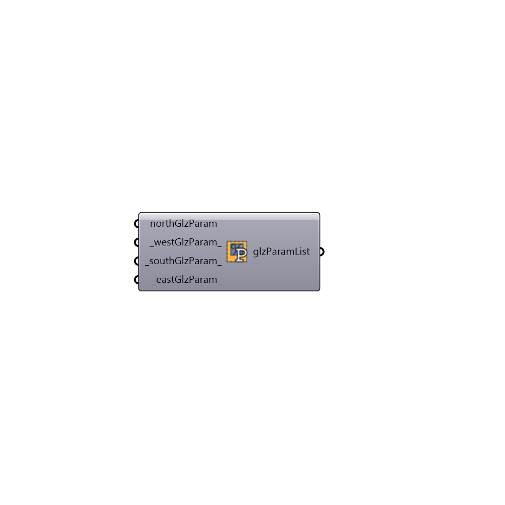

##  Glazing Parameters List - [[source code]](https://github.com/ladybug-tools/honeybee-legacy/tree/master/src/Honeybee_Glazing%20Parameters%20List.py)

Use this component to generate lists of glazing ratios, breakUp diatance, window heigths, sill heights, or vertical glazing splits for the four primary cardinal directions.
 Depeding on your intended use of the numbers connected to this component, they should be plugged into the _glzRatio, breakUpWindow_, windowHeight_, sillHeight_, or splitGlzVertically_ inputs of the "Glazing based on ratio" component.
 -
 

#### Inputs
* ##### northGlzParam [Default]
Glazing parameter for the north side of a building.
* ##### westGlzParam [Default]
Glazing parameter for the west side of a building.
* ##### southGlzParam [Default]
Glazing parameter for the south side of a building.
* ##### eastGlzParam [Default]
Glazing parameter for the east side of a building.

#### Outputs
* ##### glzParamList
A list of glazing parameters for different cardinal directions to be plugged into either the _glzRatio, breakUpWindow_, windowHeight_, sillHeight_, or splitGlzVertically_ input of the "Glazing based on ratio" component.

[Check Hydra Example Files for Glazing Parameters List](https://hydrashare.github.io/hydra/index.html?keywords=Honeybee_Glazing Parameters List)