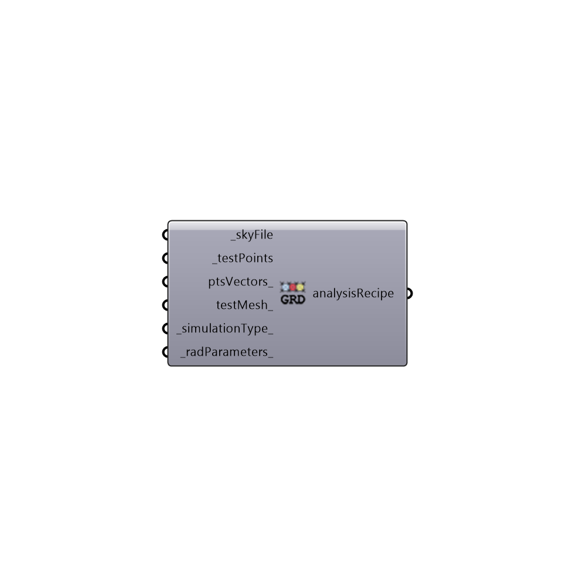

##  Grid Based Simulation - [[source code]](https://github.com/ladybug-tools/honeybee-legacy/tree/master/src/Honeybee_Grid%20Based%20Simulation.py)

Analysis Recipie for Grid-Based Analysis
 -
 

#### Inputs
* ##### skyFile [Required]
Path to a radiance sky file
* ##### testPoints [Required]
Test points
* ##### ptsVectors [Optional]
Point vectors
* ##### testMesh [Optional]
Script variable gridBasedSimulation
* ##### simulationType [Default]
[0] illuminance(lux), [1] radiation (kwh), [2] luminance (Candela)
* ##### radParameters [Default]
Radiance parameters

#### Outputs
* ##### analysisRecipe
Recipe for grid-based analysis

[Check Hydra Example Files for Grid Based Simulation](https://hydrashare.github.io/hydra/index.html?keywords=Honeybee_Grid Based Simulation)