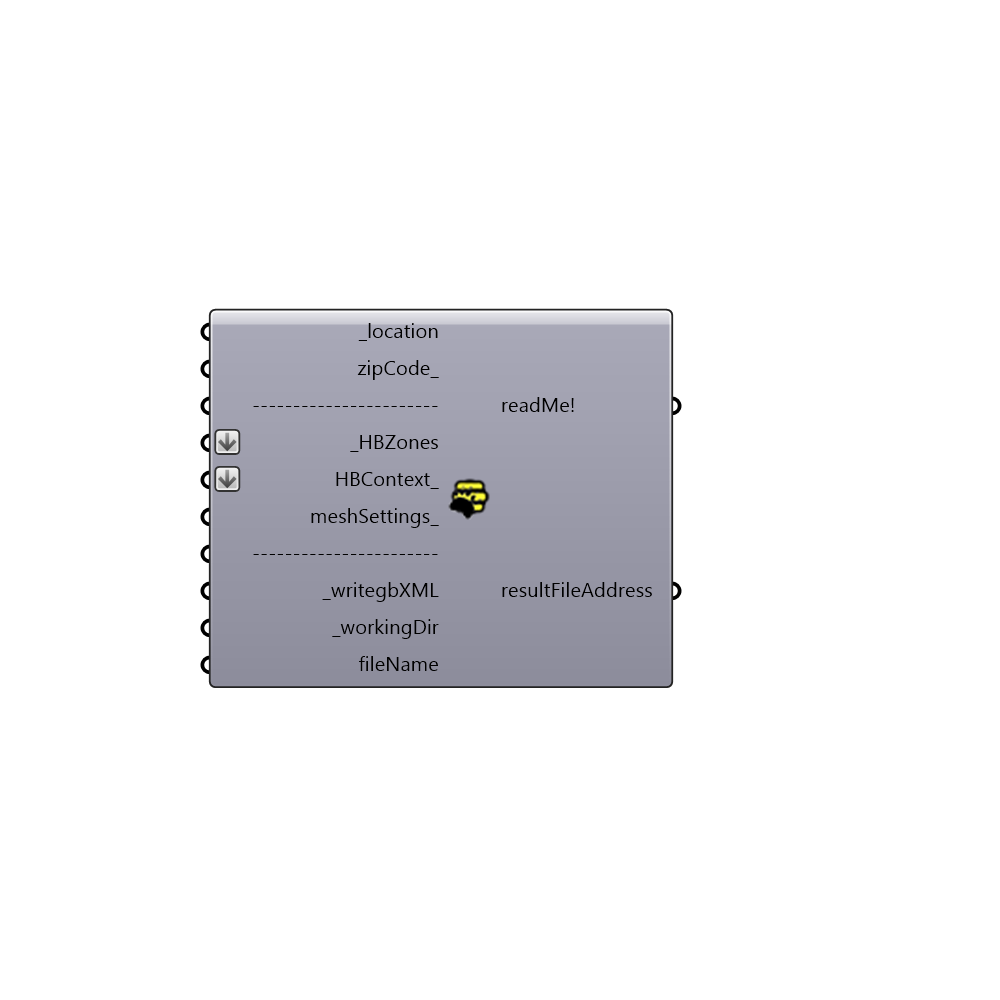

##  GrizzlyBear

Grizzlybear exports Honeybee zones to gbXML file
 -
 

#### Inputs
* ##### location [Required]
Script variable _location
* ##### zipCode [Optional]
Script variable zipCode_
* ##### HBZones [Required]
Input your honeybee zones
* ##### HBContext [Optional]
Script variable HBContext_
* ##### meshSettings [Optional]
Custom mesh setting. Use Grasshopper mesh setting components
* ##### writegbXML [Required]
Set to true to create gbxml
* ##### workingDir []
C:\gbXML by default
* ##### fileName []
choose a filename, no need to add the xml extension.  

#### Outputs
* ##### readMe!
...
* ##### resultFileAddress
...

[Check Hydra Example Files for GrizzlyBear](https://hydrashare.github.io/hydra/index.html?keywords=Honeybee_GrizzlyBear)