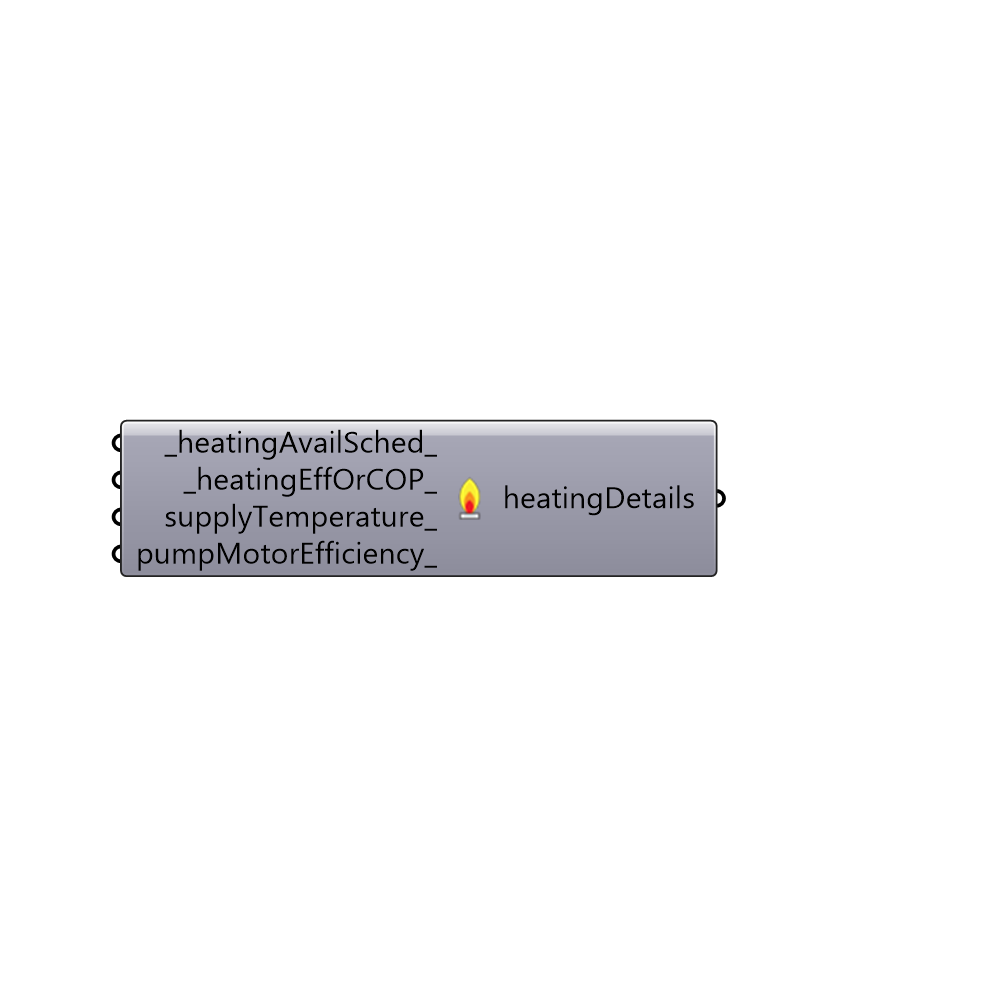

##  HVAC Heating Details - [[source code]](https://github.com/mostaphaRoudsari/honeybee/tree/master/src/Honeybee_HVAC%20Heating%20Details.py)

Use this component to set the parameters of a HVAC heating system that has been assigned with the "Honeybee_HVAC Systems" component.
 _
 Not all of the inputs on this component are assignable features of all HVAC systems.  However, most HVAC systems have these features and, if you assign a parameter that is not usable by a certain HVAC system, the "Honeybee_HVAC Systems" component will give you a warning to let you know.
 -
 

#### Inputs
* ##### heatingAvailSched [Default]
A text string representing the availability shcedule of the heating system.  This can be either a shcedule from the schedule libirary or a CSV file path to a CSV schedule you created with the "Honeybee_Create CSV Schedule" component.  The default is set to 'ALWAYS ON.'
* ##### heatingEffOrCOP [Default]
A number that sets the reference efficiency of the primary heating component (under design-day conditions). For a system with a boiler, this is the fraction of energy contained within fuel that is converted into usable heat energy (default boiler efficiencies are typically between 0.7 and 0.9). For electric heat pump systems, this value is the coefficient of performance (COP) of the heat pump ot the ratio of heat added by the heat pump system per unit of electricity input. Defaults COPs typically range from 2 to 5 depending on the system type.
* ##### supplyTemperature [Optional]
A number representing the temperature of the water leaving the boiler in degrees Celsius.  This input does not have an effect on direct expansion heat pump systems.  If left blank, the default temperature is usually 82.0 degrees Celsius.
* ##### pumpMotorEfficiency [Optional]
A number between 0 and 1 that represents the motor efficiency of the hot water pump.  This input does not have an effect on direct expansion cooling systems.  If left blank, the defualt efficiency is usally 0.9.
* ##### centralPlant [Optional]
Set to "True" to have all instances of this HVAC Type have a single central heating plant.  If set to False or left blank, each branch of a HBZone data tree that is plugged into this component will have a separate heating plant.

#### Outputs
* ##### heatingDetails
...returns the chiller description

[Check Hydra Example Files for HVAC Heating Details](https://hydrashare.github.io/hydra/index.html?keywords=Honeybee_HVAC Heating Details)