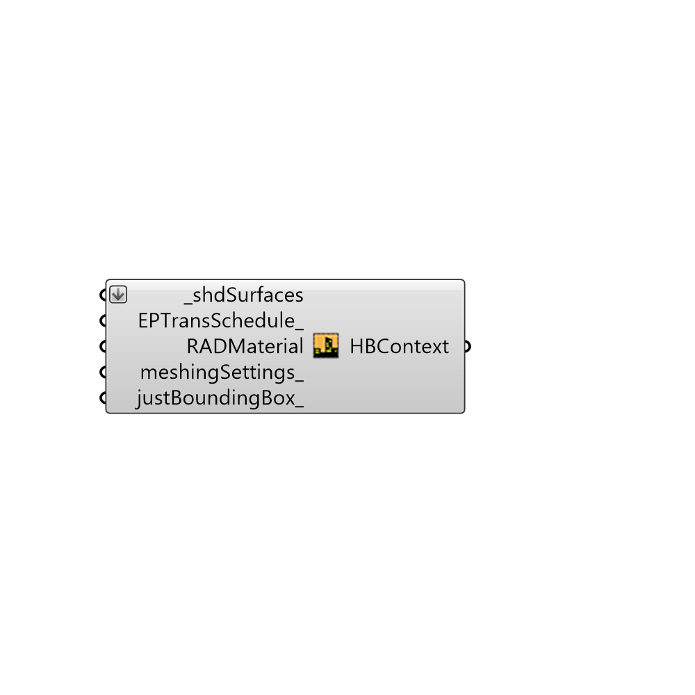

##  Honeybee EP context Surfaces - [[source code]](https://github.com/mostaphaRoudsari/honeybee/tree/master/src/Honeybee%20EP%20context%20Surfaces.py)

prepare shading/context geometries

#### Inputs
* ##### shdSurfaces [Required]
Script variable Python
* ##### EPTransSchedule [Optional]
Script variable HB_EPContextSrf
* ##### RADMaterial []
Script variable HB_EPContextSrf
* ##### meshingSettings [Optional]
Script variable HB_ShdSrf
* ##### justBoundingBox [Optional]
Script variable HB_ShdSrf

#### Outputs
* ##### HBContext
Script variable Python

[Check Hydra Example Files for Honeybee EP context Surfaces](https://hydrashare.github.io/hydra/index.html?keywords=Honeybee EP context Surfaces)