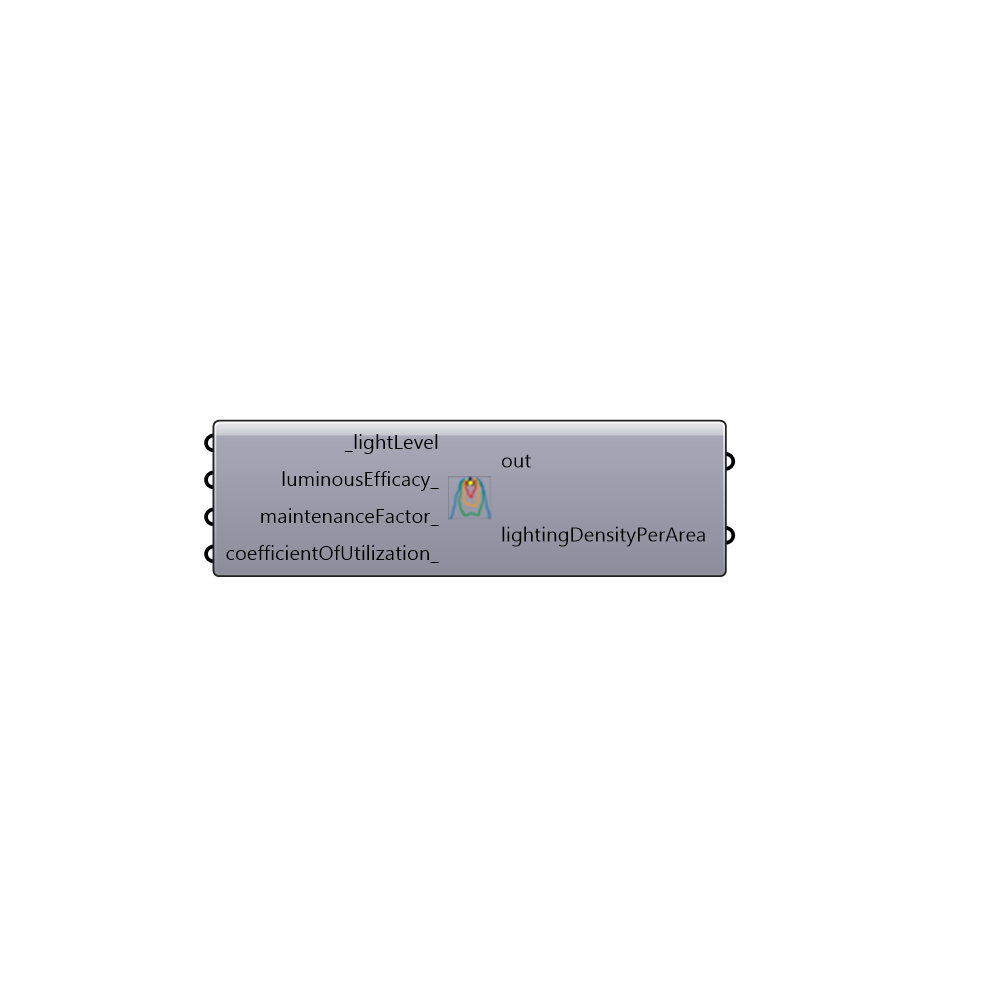

##  Honeybee Lighting Density Calculator - [[source code]](https://github.com/mostaphaRoudsari/honeybee/tree/master/src/Honeybee%20Lighting%20Density%20Calculator.py)

Use this component to calculate the Lighting Density Per Area Load from information about your bulb, fixture type, mainteneance, and required lighting level.
 Plug the result to the Honeybee setEPZoneLoads component, lightingDensityPerArea_ input
 -
 

#### Inputs
* ##### lightLevel [Required]
A number representing the required light level in the room in lux. For instance, 500 lux for a typical office area or 300 lux for a typical residential space. Note that a lux value input here means that light level is reached everywhere on the room floor plan.
* ##### luminousEfficacy [Optional]
A value between 0 and 100 that represents how well a light source produces visible light in lumens/Watt. More specifically, it is the ratio of luminous flux (in Lumens) coming from a buld to electrical power (in Watts) going into the bulb. Here are some common options:
 92 = Fluorescent (T5 tube)
 81 = 8.7 W LED screw base lamp (120 V)
 80 = Fluorescent (T8 tube)
 52 = Compact Flourescent
 13.8 = Incandescent
 0.3 = Candle
 The default is set to 80 lm/W for Fluorescent (T8), which is also close to LED lamps.
 Sources - http://en.wikipedia.org/wiki/Luminous_efficacy, http://sustainabilityworkshop.autodesk.com/buildings/electric-light-sources
* ##### maintenanceFactor [Optional]
A number between 0 and 1 that represents how often the lights are cleaned and replaced (higher numbers mean more often). It takes into account such factors as decreased efficiency with age, accumulation of dust within the fitting itself and the depreciation of reflectance as walls and reflecting surfaces age. 
 For convenience, it is usually given as three options:
 0.70 = Good
 0.65 = Medium
 0.55 = Poor
 The default is set to 0.65 for Medium.
 Source - http://sustainabilityworkshop.autodesk.com/buildings/light-fixtures-and-layout
* ##### coefficientOfUtilization [Optional]
A number between 0 and 1 that represents the fraction of the lumens from the bulb that finally find their way to the work plane (higher values indicate a more efficient fixture). This number depends on the particular fixture type, the number of lamps in it, the lens used, its beam pattern, the shape of the room (Room Cavity Ratio, RCR) and the reflectances of the ceiling (Rc), walls (Rw) and floor (Rf).
 Here are some common Examples:
 0.84 = Basic Fluorescent Strip
 0.72 = Deep-Cell Parabolic Louver
 0.55 = Small-Cell Parabolic Louver
 The default is set to 0.84 for a Basic Fluorescent Strip
 Source - http://www.gelighting.com/LightingWeb/na/resources/tools/epact-estimator/popup-cu-ratings.jsp

#### Outputs
* ##### out
The execution information, as output and error streams
* ##### lightingDensityPerArea
(W/m2)The lighting load per square meter of floor, which can be plugged into the "Set EnergyPlus Loads" component.

[Check Hydra Example Files for Honeybee Lighting Density Calculator](https://hydrashare.github.io/hydra/index.html?keywords=Honeybee Lighting Density Calculator)