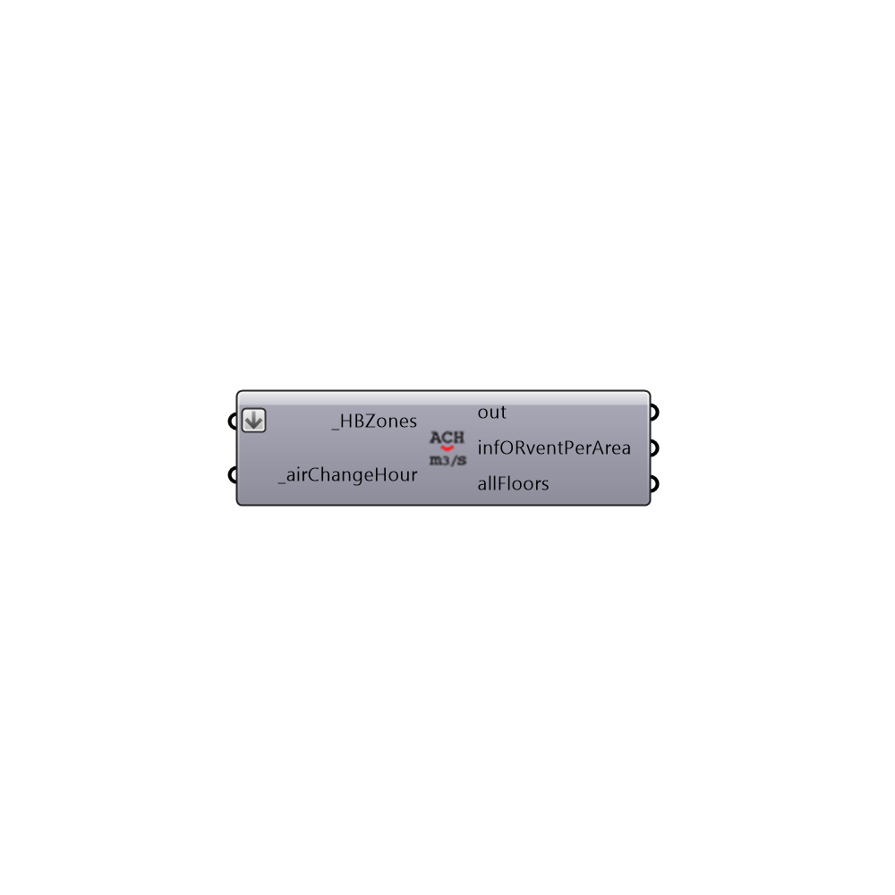

##  Honeybee infORventPerArea Calculator

Use this component to transform ACH to m3/s-m2.
 Plug the result to the Honeybee setEPZoneLoads component, infiltrationRatePerArea_ or  infiltrationRatePerArea_ inputs
 -
 

#### Inputs
* ##### HBZones [Required]
Honeybee zones for which you want to calculate the infiltration or ventilation rates.
* ##### airChangeHour [Required]
Air Changes per Hour. 

#### Outputs
* ##### out
The execution information, as output and error streams
* ##### infORventPerArea
infiltrationRatePerArea or ventilationPerArea in m3/s-m2 (Cubic meters per second per square meter of floor)
* ##### allFloors
Script variable Python

[Check Hydra Example Files for Honeybee infORventPerArea Calculator](https://hydrashare.github.io/hydra/index.html?keywords=Honeybee infORventPerArea Calculator)