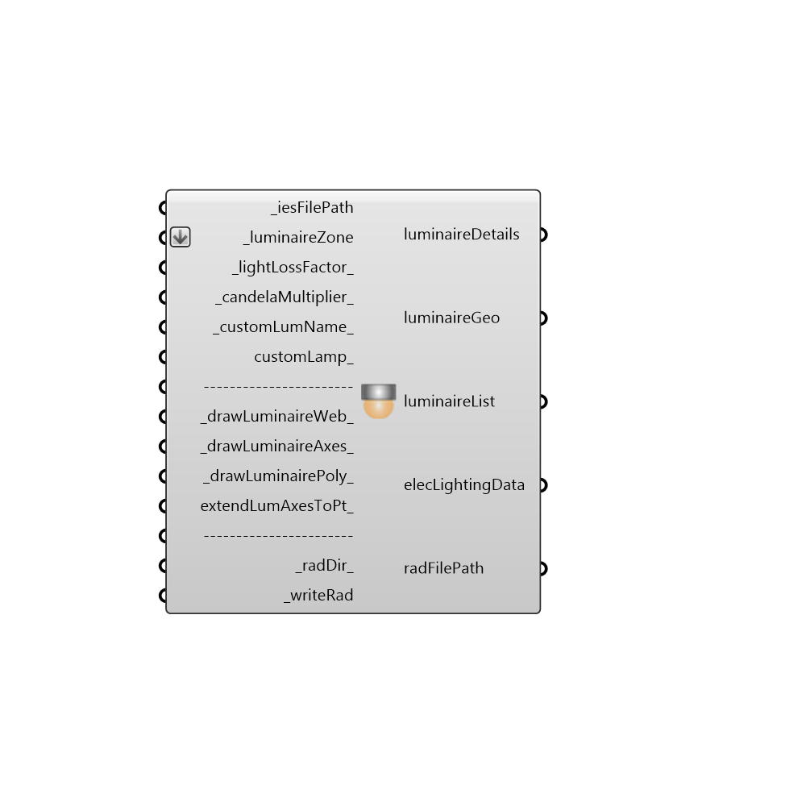

##  IES Luminaire

This is the core component for adding photometric data into a lighting simulation. 
 It parses an IES photometric file to create a geometric representation of the photometric data on the Rhino viewport. 
 It also calls xform and ies2rad, two programs within RADIANCE, to create a RADIANCE representation of the photometric data.
 In case _writeRad is set to True and all the other input requirements are satisfied a .rad file containing photometric information will be created.
 This file, accessible through radFilePath should be connected to the additionalRadFiles_ input in the Honeybee Run Daylight Simulation component.
 .
 .
 Technical Notes:
 ----------------------
 The parsing of IES files is based on IES LM-63-2002. 
 .
 This component is only compatible with Type C photometry. 
 However, if Type B photometry is to be used, external programs such as the Photometric Toolbox can be used to convert Type B photometry to Type C.
 .
 The luminous shapes, as defined by LM-63-2002 currently compatible with this component are rectangular, circular and rectangular with luminous openings.
 .
 The curves drawn for creating the luminaire web is not based on interpolation. So it is possible that the curve may look irregular in case the number of vertical angles are less.
 .
 Suggested practices/workflow:
 ------------------------------------------
 The _writeRad option should only be set to True once the amiming and positioning of luminaires has been confirmed.
 .
 In case the photometric distribution of the luminaire is not quadrilaterally symmetric, the _drawLuminaireWeb_ option should be set to True.
 This will help in aiming and locating the luminaire properly.
 .
 In case the customLamp_ option is being used, the lumen depreciation factor of the custom lamp should be properly set for illuminance or luminance calculations.

#### Inputs
* ##### iesFilePath [Required]
Specify the file path for .ies photometry file.
* ##### luminaireZone [Required]
List of (3-d coordinate, Aiming Angle) combinations that are generated through the IES Luminaire Array component.
* ##### lightLossFactor [Default]
An optional number that will be multiplied by the luminosity of the light.  This can be used to account for different light bulb luminosities or light loss from additional fixture obstructions around the light. The default is set to 1.0.
* ##### candelaMultiplier [Default]
Assign a scaling value for the candela tables. This value gets multiplied by the _lightLossFactor_ value. Default is set to 1.0.
* ##### customLumName [Default]
Specify a custom name for the luminaire. This input should only be used in case the manufacturer hasn't provided a value for [LUMCAT] in the photometric data.
* ##### customLamp [Optional]
Specify a custom lamp using the IES Custom Lamp component
* ##### drawLuminaireWeb [Default]
Draw a geometric representation of the candela distribution of the luminaire on the Rhino viewport. If set to True then geometry normalized to unit dimensions will be drawn. If a number is provided, then geometry will be drawn and scaled to that value.
* ##### drawLuminaireAxes [Default]
Draw the C0-G0 axes of the luminaire on the Rhino viewport. If set to True then axes normalized to 1.5 times the unit dimensions will be drawn. If a number is provided, then geometry will be drawn and scaled to that value.
* ##### drawLuminairePoly [Default]
Draw the polygon, circle or box representing the luminous opening of the luminaire on the Rhino viewport. If set to True then geometry normalized to unit dimensions will be drawn. If a number is provided, then geometry will be drawn and scaled to that value.
* ##### extendLumAxesToPt [Optional]
Specify a point to which the luminaire axes should be extended to. Please note that if the aiming of the luminaire is very far way from this point then some abnormal results might be seen.
* ##### radDir [Default]
Custom location for the luminaire rad file. The default location is inside the Ladybug folder on your system.
* ##### writeRad [Required]
Set to True to create the file for electric lighting simulation.

#### Outputs
* ##### luminaireDetails
A description of the luminaire generated after parsing the IES file.
* ##### luminaireGeo
The geometry created in the Rhino viewport for visualizing the luminaire. Can be used for generating previews.
* ##### luminaireList
List of luminaires and their locations and mounting angles.
* ##### elecLightingData
Details about the luminaire, locations and lamps used in the simulation. Connect this output to the _elecLightingData input of the Honeybee_IES Project component.
* ##### radFilePath
Location of the RAD file that should be included in the project. Connect this output to the _additionalRadFiles_ input in the Honeybee_Run_DaylightSimulation module. This output will soon be deprecated. It is recommended that you use the elecLightingData output instead.

[Check Hydra Example Files for IES Luminaire](https://hydrashare.github.io/hydra/index.html?keywords=Honeybee_IES Luminaire)