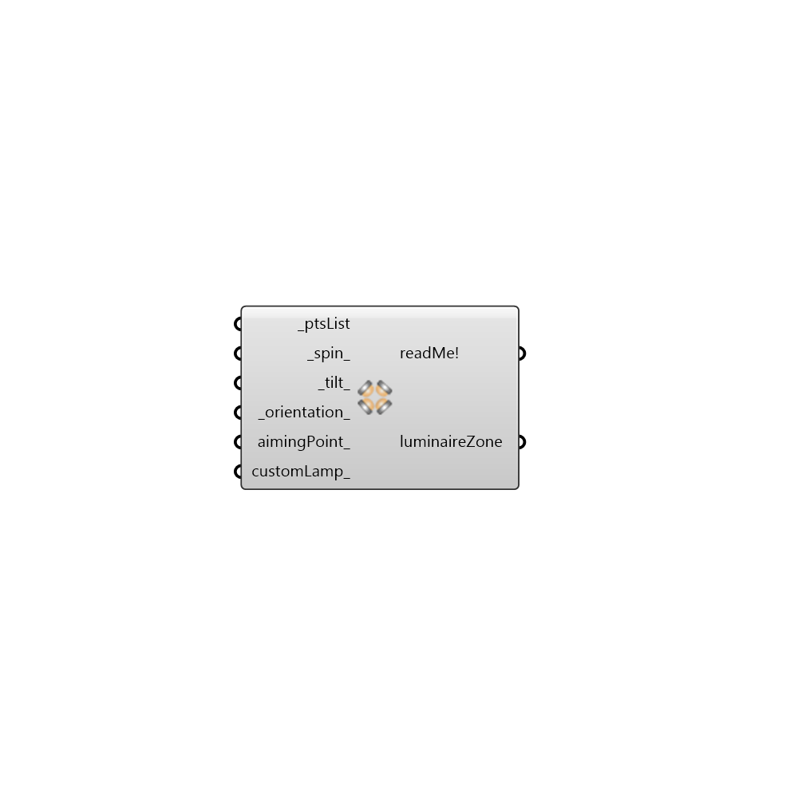

##  IES Luminaire Zone

    This component is to be used for specifying the location of luminaires for electric lighting simulations.
     -
     For external lighting applications the best option would be to use the aimingPoint_ option to specify where all the luminaires should be aimed to.
     In case luminaires are being aimed by specifying spin, tilt and orientation angles, the following conventions apply:
 1. _spin_ : specifies the rotation of a luminaire about its G0 axis.
 2. _tilt_: species the rotation of a luminaire around the Y axis.
 3. _orientation_: specifies the rotation of a luminaire around the Z axis.
     The recommended sequence of applying rotations is tilt,orientation and spin. 
     _
     The aiming conventions followed in this component are based on the IES LM-63-2002 and were tested against indoor lighting simulations with AGI32 software.

#### Inputs
* ##### ptsList [Required]
List of points/3d coordinates where the luminaires are to be located.
* ##### spin [Default]
A number represeting the luminaire spin angle in degrees.  This can also be a list of spin angles that match the _ptsList.
* ##### tilt [Default]
A number represeting the luminaire tilt angle in degrees.  This can also be a list of tilt angles that match the _ptsList.
* ##### orientation [Default]
A number represeting the luminaire rotation angle in degrees.  This can also be a list of orientation angles that match the _ptsList.
* ##### aimingPoint [Optional]
A point represeting the location at which the photometric axis of the luminaires should be aimed. This can also be a list of points that match the _ptsList.
* ##### customLamp [Optional]
A custom lamp definition from the "Honeybee_IES Custom Lamp" component.

#### Outputs
* ##### readMe!
The execution information, as output and error streams
* ##### luminaireZone
List of coordinates and rotation angles for luminaires

[Check Hydra Example Files for IES Luminaire Zone](https://hydrashare.github.io/hydra/index.html?keywords=Honeybee_IES Luminaire Zone)