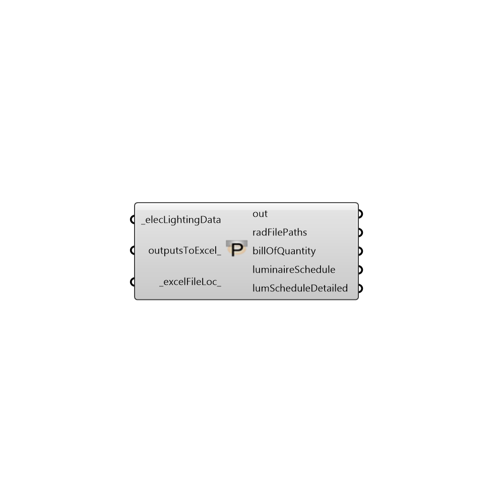

##  IES Project

This component is meant for summarizing the details of all the luminaires used in a simulation.

#### Inputs
* ##### elecLightingData [Required]
Connect the elecLightingData output of the Honeybee_IES Luminaire component here.
* ##### outputsToExcel [Optional]
Set this input to True if the outputs are to be written to a MS Excel compatible .csv file.
* ##### excelFileLoc [Default]
Specify a directory to which the MS Excel file should be saved to.

#### Outputs
* ##### out
The execution information, as output and error streams
* ##### radFilePaths
List of .rad files corresponding to the luminaires to be used in the simulation. Connect this to the additionalRadFiles_ input of Honeybee_Run Daylight Simulation component.
* ##### billOfQuantity
The bill of quantity of the luminaires used for simulation.
* ##### luminaireSchedule
List of luminaires, their location and aiming angles.
* ##### lumScheduleDetailed
A more detailed luminaire schedule that includes information about custom lamps (if any) used in the simulation.

[Check Hydra Example Files for IES Project](https://hydrashare.github.io/hydra/index.html?keywords=Honeybee_IES Project)