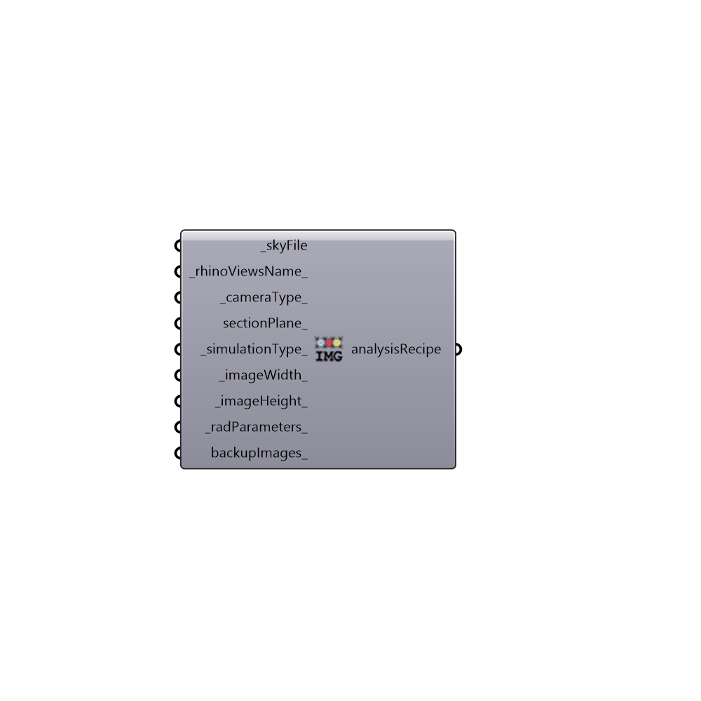

##  Image Based Simulation - [[source code]](https://github.com/mostaphaRoudsari/honeybee/tree/master/src/Honeybee_Image%20Based%20Simulation.py)

Analysis Recipie for Image-Based Analysis
 -
 

#### Inputs
* ##### skyFile [Required]
Path to a radiance sky file
* ##### rhinoViewsName [Default]
viewName to be rendered
* ##### cameraType [Default]
[0] Perspective, [1] FishEye, [2] Parallel
* ##### sectionPlane [Optional]
Optional view fore clipping plane. The Plane should be perpendicular to the view
* ##### simulationType [Default]
[0] illuminance(lux), [1] radiation (wh), [2] luminance (Candela). Default is 2 > luminance.
* ##### imageWidth [Default]
Optional input for image width in pixels
* ##### imageHeight [Default]
Optional input for image height in pixels
* ##### radParameters [Default]
Radiance parameters
* ##### backupImages [Optional]
[0] No backup, [1] Backup in the same folder, [2] Backup in separate folders. Default is 0.

#### Outputs
* ##### analysisRecipe
Recipe for image-based simulation

[Check Hydra Example Files for Image Based Simulation](https://hydrashare.github.io/hydra/index.html?keywords=Honeybee_Image Based Simulation)