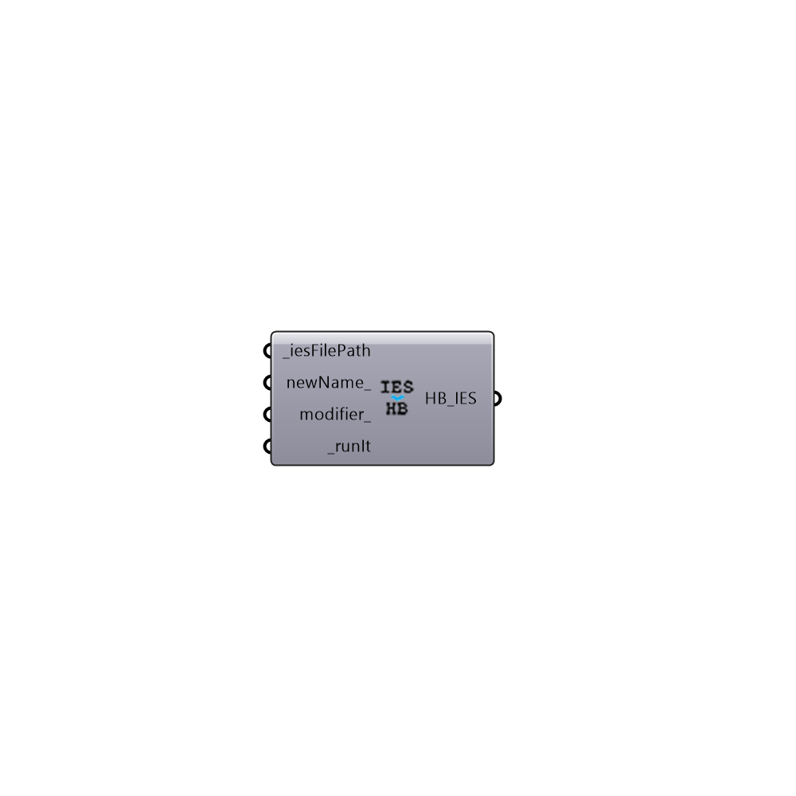

##  Import IES

Import IES files
 -
 

#### Inputs
* ##### iesFilePath [Required]
Filepath to a valid IES file
* ##### newName [Optional]
Optional new name for the ies file
* ##### modifier [Optional]
Optional number between 0 and 1 which will be "multiplied by "all output quantities. This is the best way to scale fixture brightness for different lamps, but care should be taken when this option is applied to multiple files."
* ##### runIt [Required]
Set to True to import the IES file

#### Outputs
* ##### HB_IES
HB IES object. Do not scale or rotate this object. Just locate it in the right place

[Check Hydra Example Files for Import IES](https://hydrashare.github.io/hydra/index.html?keywords=Honeybee_Import IES)