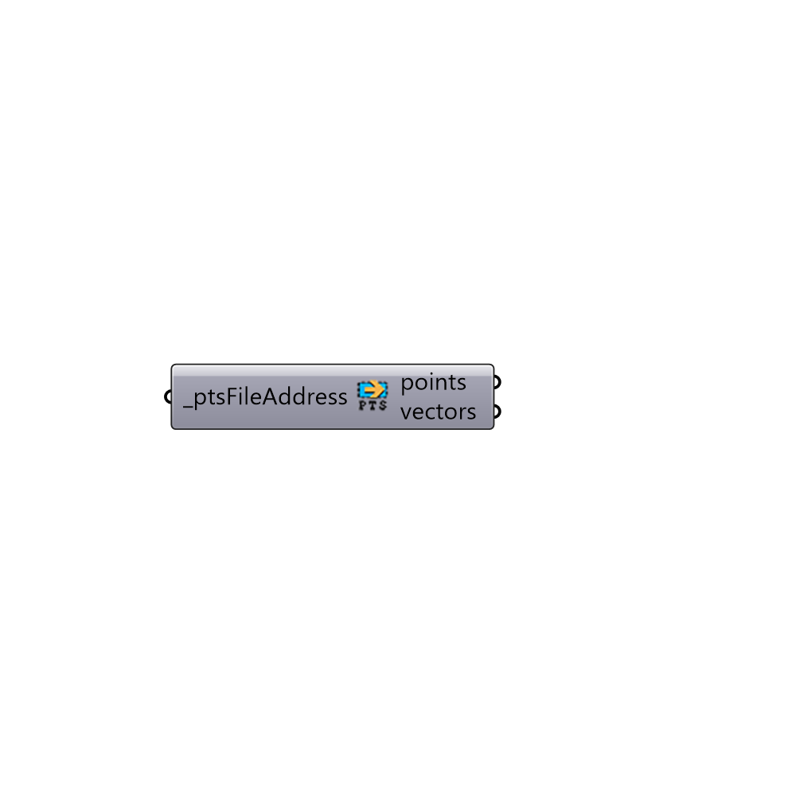

##  Import Pts File - [[source code]](https://github.com/mostaphaRoudsari/honeybee/tree/master/src/Honeybee_Import%20Pts%20File.py)

Import Radiance Test Grid
 -
 

#### Inputs
* ##### ptsFileAddress [Required]
Script input resultFileAddress.

#### Outputs
* ##### points
Script output monthlyHeating.
* ##### vectors
Script variable readIdf

[Check Hydra Example Files for Import Pts File](https://hydrashare.github.io/hydra/index.html?keywords=Honeybee_Import Pts File)