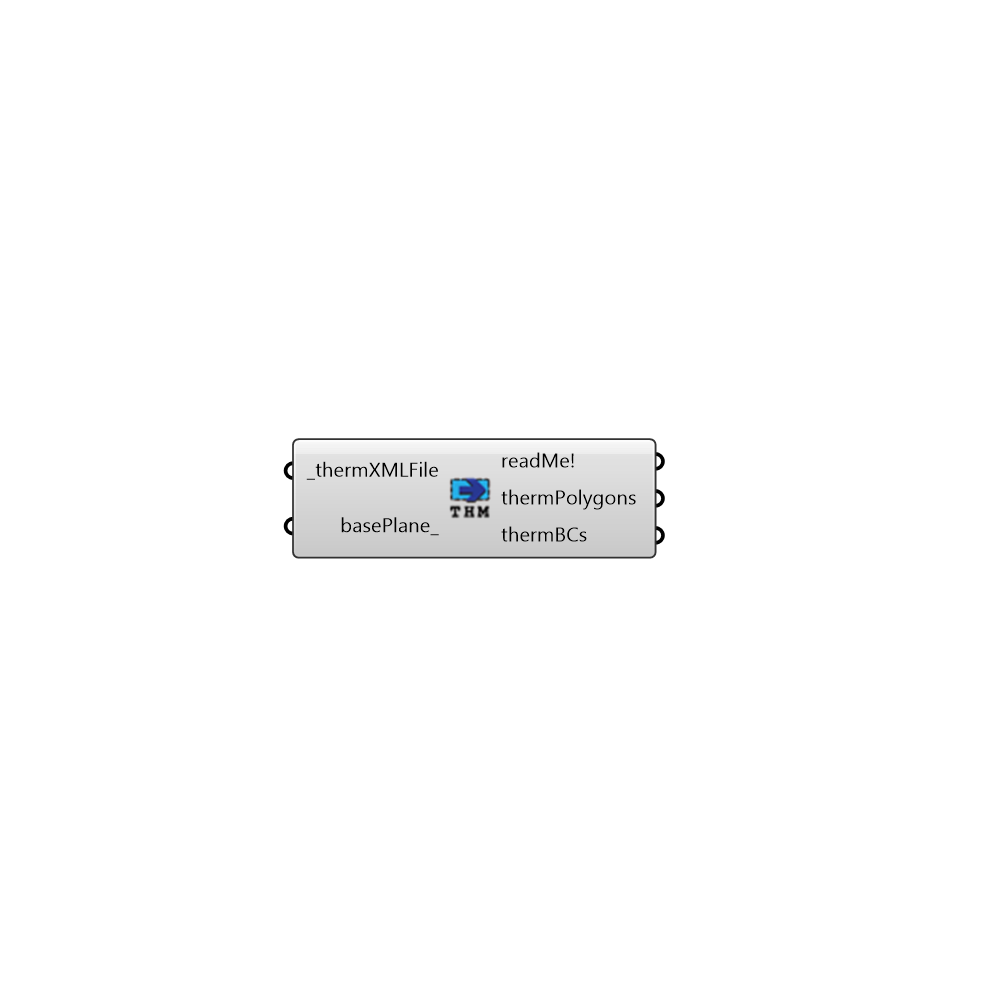

##  Import THERM XML

Use this component to read the content of a THERM XML file into Grasshopper.  The component will extract both THERM polygons and boundary conditions along with all of their properties.
 _
 At this point in time, U-Factor tags are not supported but all other features should be imported.
 -
 

#### Inputs
* ##### thermXMLFile [Required]
A filepath to a therm XML file on your machine.
* ##### basePlane [Optional]
An optional plane or point to set the location and orientation of the THERM file geometry in the Rhino scene.  The default will seatch for location information within the THERM file and, if none is found, geomtry is brought into the World XY plane.

#### Outputs
* ##### readMe!
...
* ##### thermPolygons
The therm polygons within the therm XML file.
* ##### thermBCs
The therm boundary conditions within the therm XML file.

[Check Hydra Example Files for Import THERM XML](https://hydrashare.github.io/hydra/index.html?keywords=Honeybee_Import THERM XML)