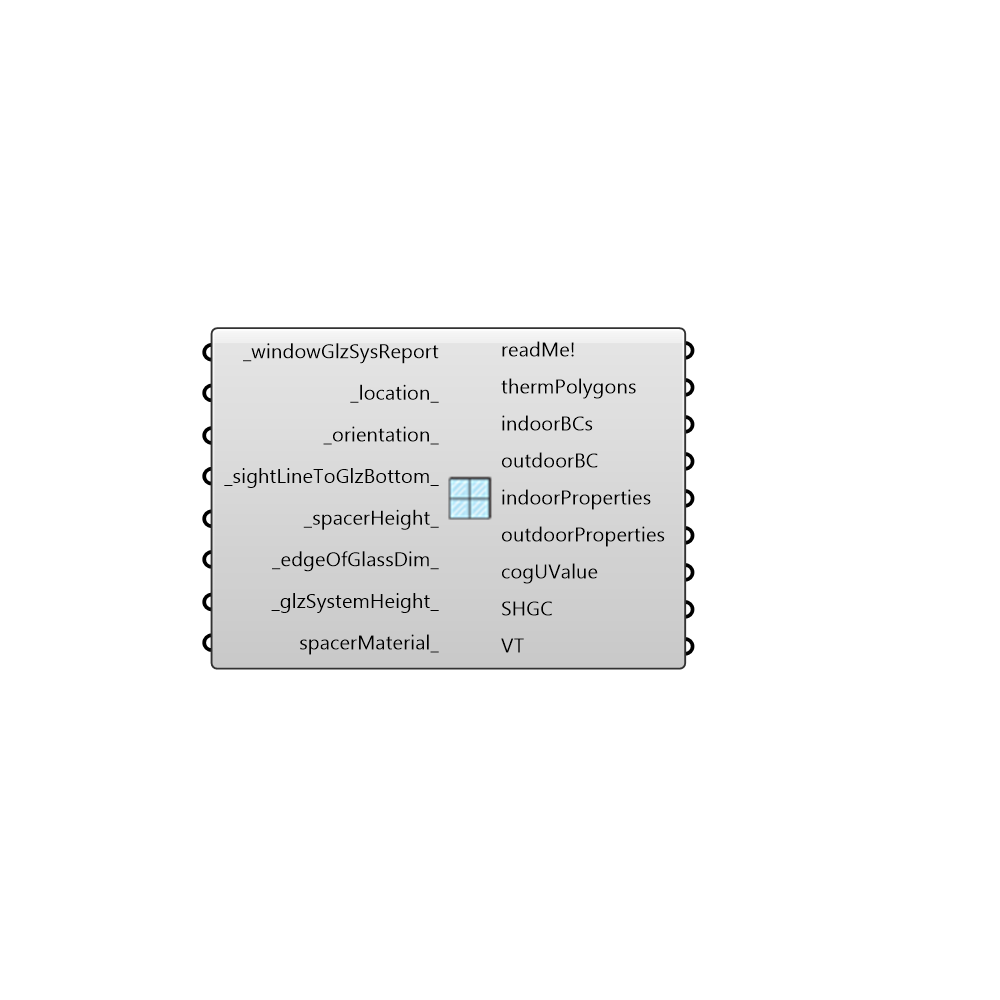

##  Import WINDOW Glz System - [[source code]](https://github.com/mostaphaRoudsari/honeybee/tree/master/src/Honeybee_Import%20WINDOW%20Glz%20System.py)

Use this component to import the content of a LBNL WINDOW text file report as a series of polygons and boundary conditions that can be plugged into the "Write THERM File' component.
 -
 

#### Inputs
* ##### windowGlzSysReport [Required]
A filepath to a detailed galzing system text file report exportedby WINDOW.
* ##### location [Default]
An optional plane or point to set the location of the glazing system in the Rhino scene.  The default is set to the Rhino origin and in the XY plane.
* ##### orientation [Default]
An integer that sets the orientation of the window in the Rhino scene.  Choose from the following options that correspond with THERM's options:
 0 = Up
 1 = Down
 2 = Left
 3 = Right
* ##### sightLineToGlzBottom [Default]
A number in Rhino model units that represents the distance from the bottom of the glass pane to the end of the frame (where the 'edge of glass' starts).  The default is set to 12.7 mm.
* ##### spacerHeight [Default]
A number in Rhino model units that represents the distance from the bottom of the glass pane to the end of the spacer. The default is set to 12.7 mm.
* ##### edgeOfGlassDim [Default]
A number in Rhino model units that represents the distance from the start of the frame to the start of the 'center of glass' zone.  This 'edge of glass' zone typically has a U-Value that is higher than the rest of the glass. The default is set to 63.5 mm.
* ##### glzSystemHeight [Default]
A number in Rhino model units that represents the height to make the glazing system in the Rhino scene.  The default is set to 150 mm.
* ##### spacerMaterial [Optional]
An optional material that will be used to create a spacer for the glazing system.  If no material is input here, no psacer will be created.

#### Outputs
* ##### readMe!
...
* ##### thermPolygons
The therm polygons for the glazing system.
* ##### indoorBCs
The thermBCs that represent the interior side of the glazing system, including separate boundary conditions for the edge of frame and center of glass.  Note that a boundary condition for with the 'Frame' UFactorTag must be made separately.
* ##### outdoorBC
A single thermBC that represents the exterior side of the glazing system.  This includes the exterior conditions taken from the report.
* ##### indoorProperties
A list of properties for the interior boundary condition in the following order: Name, temperature, film coefficient.  These can be used to create a boundary condition for the 'Frame.'
* ##### outdoorProperties
A list of properties for the exterior boundary condition in the following order: Name, temperature, film coefficient.  These can be used to create a boundary condition that includes the frame of the window.
* ##### cogUValue
A value representing the "center of glass" U-value for the imported WINDOW glazing construction in SI units (W/m2-K).  This output can be used in conjunction with the "Honeybee_Assembly Uvalue" component to calculate the full U-value of a window assembly.
* ##### SHGC
The solar heat gain coefficient of the WINDOW glazing construction.
* ##### VT
The visible transmittance of the WINDOW glazing construction.

[Check Hydra Example Files for Import WINDOW Glz System](https://hydrashare.github.io/hydra/index.html?keywords=Honeybee_Import WINDOW Glz System)