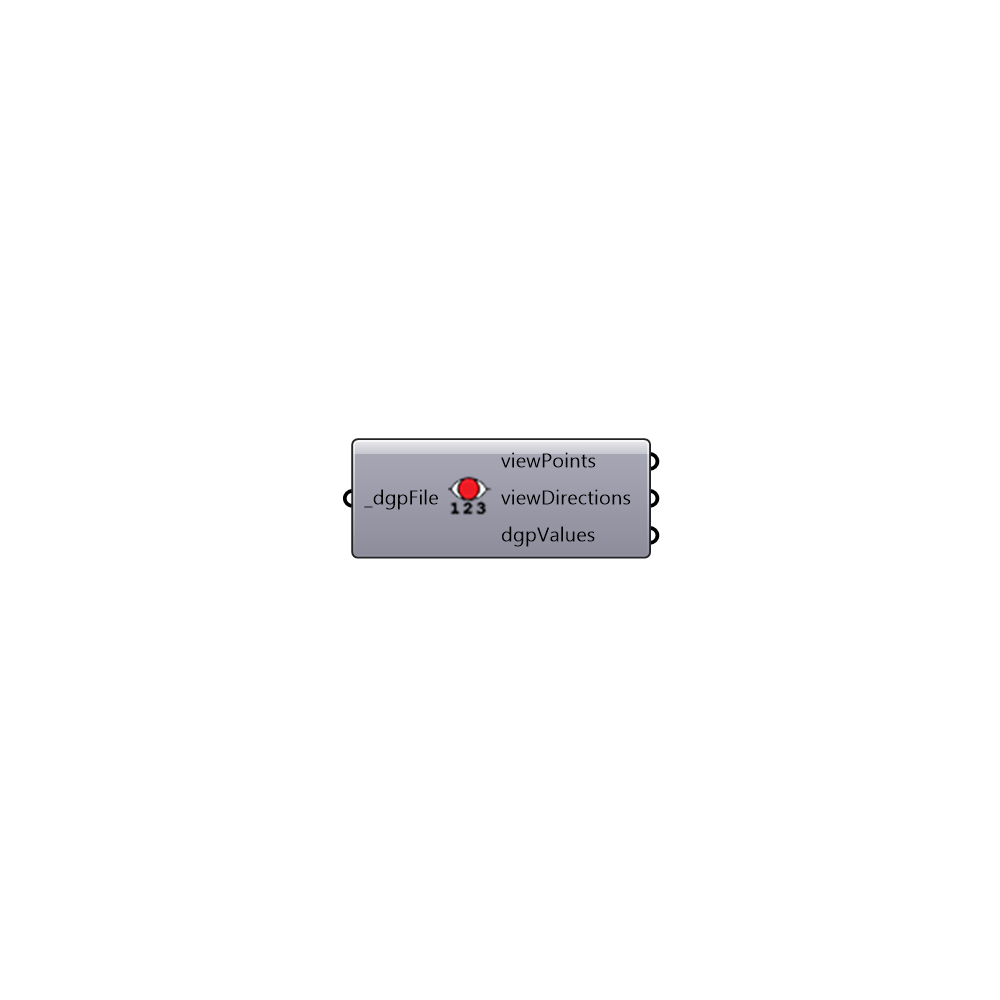

##  Import dgp File - [[source code]](https://github.com/ladybug-tools/honeybee-legacy/tree/master/src/Honeybee_Import%20dgp%20File.py)

Import Annual Daylight Glare Probability
 -
 

#### Inputs
* ##### dgpFile [Required]
Annual Daylight glare probability file

#### Outputs
* ##### viewPoints
Points that represents point of view of the person
* ##### viewDirections
Vectors that represents direction of the view. Use Ladybug 
* ##### dgpValues
Daylight glare probability values. Imperceptible Glare [0.35 > DGP], Perceptible Glare [0.4 > DGP >= 0.35], Disturbing Glare [0.45 > DGP >= 0.4], Intolerable Glare [DGP >= 0.45]

[Check Hydra Example Files for Import dgp File](https://hydrashare.github.io/hydra/index.html?keywords=Honeybee_Import dgp File)