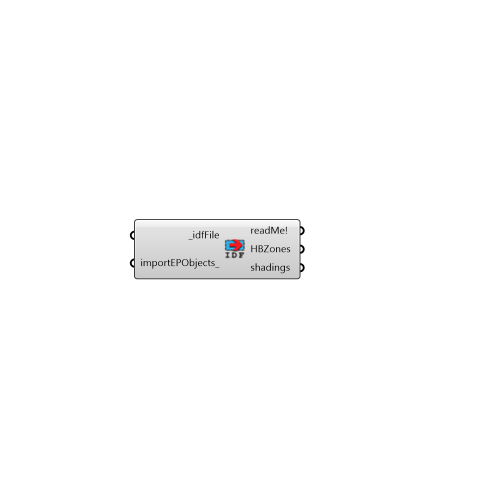

##  Import idf

import an idf file to gh
 This version only imports the geometries
 Constructions, schedules and systems will be neglected

#### Inputs
* ##### idfFile [Required]
File path to an idf file
* ##### importEPObjects [Optional]
Set to True if you want Honeybee import constructions, materials and schedules from this file. You need to do it only once. In case there is an object with similar name already in Honeybee library object will not be imported and you need to rename it in the idf file.

#### Outputs
* ##### readMe!
...
* ##### HBZones
List of Honeybee zones imported from .idf file
* ##### shadings
Shading objects if any

[Check Hydra Example Files for Import idf](https://hydrashare.github.io/hydra/index.html?keywords=Honeybee_Import idf)