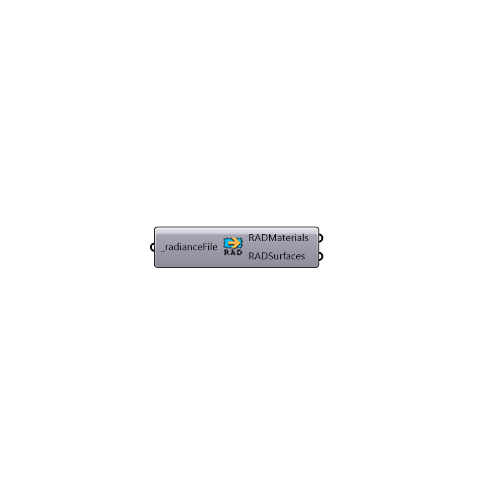

##  Import rad

Import a rad file to gh
 This component is just a proof of concept for now and needs major modifications
 -
 

#### Inputs
* ##### radianceFile [Required]
File path to radiance file

#### Outputs
* ##### RADMaterials
List of materials
* ##### RADSurfaces
List of surfaces

[Check Hydra Example Files for Import rad](https://hydrashare.github.io/hydra/index.html?keywords=Honeybee_Import rad)