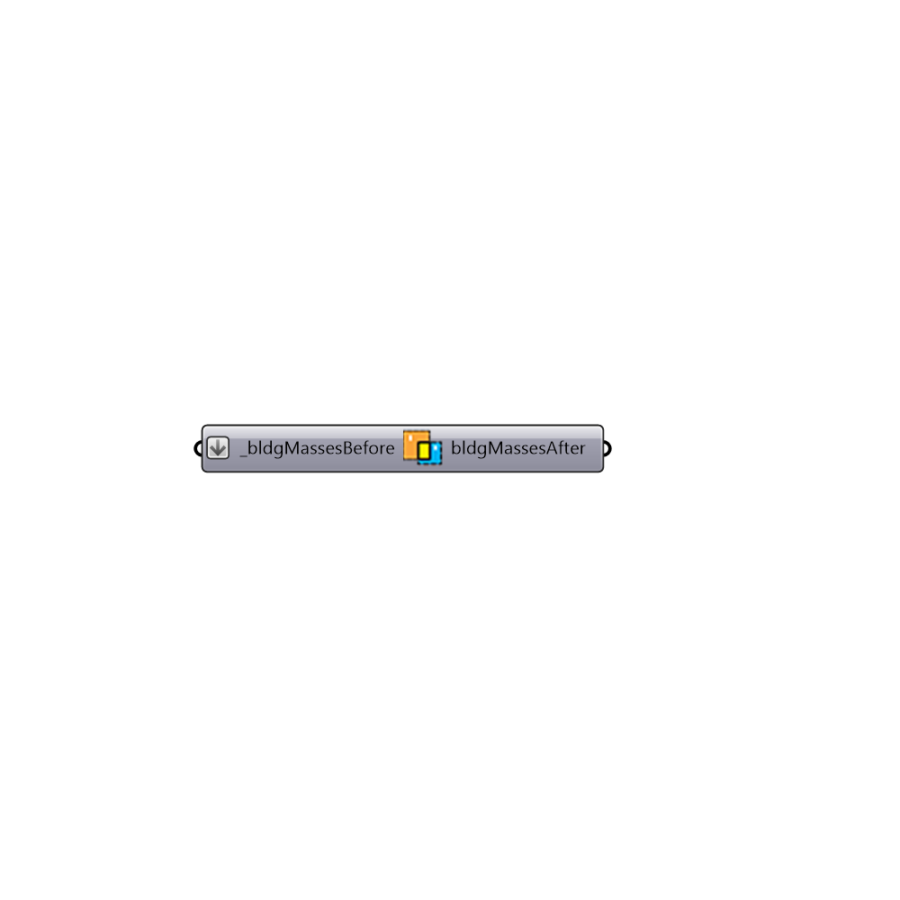

##  IntersectMasses - [[source code]](https://github.com/ladybug-tools/honeybee-legacy/tree/master/src/Honeybee_IntersectMasses.py)

Use this component to take a list of closed breps (polysurfaces) that you intend to turn into HBZones and split their component surfaces to ensure that there are matching surfaces between each of the adjacent zones.
 _
 Matching surfaces and surface areas betweem adjacent zones are necessary to ensure that the conductive heat flow calculation occurs correctly across the surfaces in an energy simulation.
 _
 Note that the input here should be closed volumes that are adjacent to each other and touching.  They should not volumetrically overlap.
 Also note that, while the component has been written in a manner that rarely fails if the input geometry obeys the provisions above, there are still some very complex cases that can be incorrect.
 As such, it is recommended that you bake the output of this component and check it in Rhino before turning the breps into HBZones.  This component will get you most of the way there but these volumetric operations can be difficult to pull off with a surface modeler like Rhino so you should really check the output.
 -
 

#### Inputs
* ##### bldgMassesBefore [Required]
Script input bldgMassesBefore.
* ##### runIt [Required]
Script variable IntersectMass

#### Outputs
* ##### bldgMassesAfter
The same input closed breps that have had their component surfaces split by adjacent polysurfaces to have matching surfaces between adjacent breps.  It is recommended that you bake this output and check it in Rhino before turning the breps into HBZones.

[Check Hydra Example Files for IntersectMasses](https://hydrashare.github.io/hydra/index.html?keywords=Honeybee_IntersectMasses)