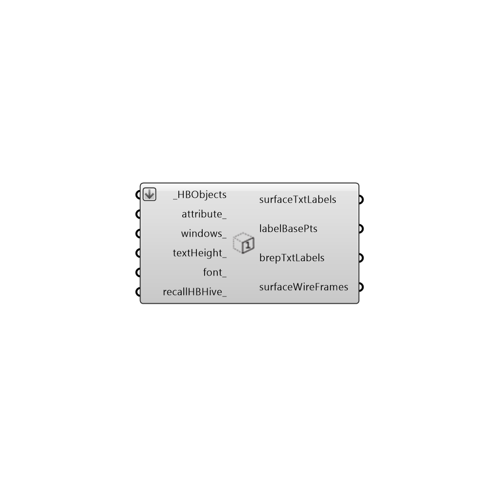

##  Label Zone Surfaces

Use this component to lablel HBSurfaces or HBZones with their names or energy/daylight properties in the Rhino scene.  This is useful for checking whether certain properties have been assigned correctly.
 -
 

#### Inputs
* ##### HBObjects [Required]
The HBZones out of any of the HB components that generate or alter zones.  Note that these should ideally be the zones that are fed into the Run Energy Simulation component.  Zones read back into Grasshopper from the Import idf component will not align correctly with the EP Result data.
* ##### attribute [Optional]
A text string for the surface attribute that you are interested in lableing the surfaces with.  Possible inputs include "name", "construction" or any other Honeybee attribute.  Use the "Honeybee_Surface Attribute List" to see all possibilities.
* ##### windows [Optional]
Set to "True" to have the component label the window surfaces in the model instead of the opaque surfaces.  By default, this is set to "False" to label just the opaque surfaces.
* ##### textHeight [Optional]
An optional number for text height in Rhino model units that can be used to change the size of the label text in the Rhino scene.  The default is set based on the dimensions of the zones.
* ##### font [Optional]
An optional number that can be used to change the font of the label in the Rhino scene. The default is set to "Verdana".
* ##### recallHBHive [Optional]
Set to "True" to recall the zones from the hive each time the input changes and "False" to simply copy the zones to memory.  Calling the zones from the hive can take some more time but this is necessary if you are making changes to the zones and you want to check them.  Otherwise, if you are just scrolling through attributes, it is nice to set this to "False" for speed.  The default is set to "True" as this is safer.

#### Outputs
* ##### surfaceTxtLabels
The names of each of the connected zone surfaces.
* ##### labelBasePts
The basepoint of the text labels.  Use this along with the surfaceAttributes ouput above and a GH "TexTag3D" component to make your own lables.
* ##### brepTxtLabels
A set of surfaces indicating the names of each zone surface as they correspond to the branches in the EP surface results.
* ##### surfaceWireFrames
Script variable Python

[Check Hydra Example Files for Label Zone Surfaces](https://hydrashare.github.io/hydra/index.html?keywords=Honeybee_Label Zone Surfaces)