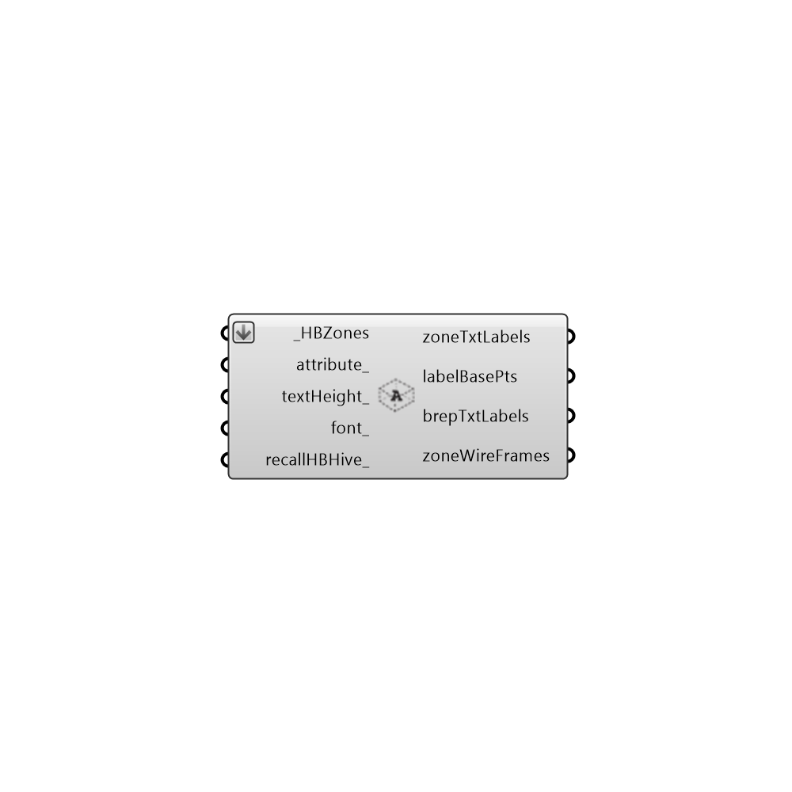

##  Label Zones - [[source code]](https://github.com/ladybug-tools/honeybee-legacy/tree/master/src/Honeybee_Label%20Zones.py)

Use this component to lablel zones with their names in the Rhino scene.  This can help ensure that the correct names are assigned to each zone and can help keep track of zones and zone data throughout analysis.
 -
 

#### Inputs
* ##### HBZones [Required]
The HBZones out of any of the HB components that generate or alter zones.  Note that these should ideally be the zones that are fed into the Run Energy Simulation component.  Zones read back into Grasshopper from the Import idf component will not align correctly with the EP Result data.
* ##### attribute [Optional]
A text string for the zone attribute that you are interested in lableing the zones with.  Possible inputs include "name", "zoneProgram", "isConditioned" or any other Honeybee attribute. Use the "Honeybee_Zone Attribute List" to see all possibilities.
* ##### textHeight [Optional]
An optional number for text height in Rhino model units that can be used to change the size of the label text in the Rhino scene.  The default is set based on the dimensions of the zones.
* ##### font [Optional]
An optional number that can be used to change the font of the label in the Rhino scene. The default is set to "Verdana".

#### Outputs
* ##### zoneTxtLabels
The label names of each of the connected zones.  Connect this ouput and the one bleow to a Grasshopper "TexTag3D" component to make your own lables.
* ##### labelBasePts
The basepoint of the text labels.  Use this along with the ouput above and a Grasshopper "TexTag3D" component to make your own lables.
* ##### brepTxtLabels
A set of surfaces indicating the names of each zone as they correspond to the branches in the EP results and the name of the zone in the headers of data.
* ##### zoneWireFrames
Script variable Python

[Check Hydra Example Files for Label Zones](https://hydrashare.github.io/hydra/index.html?keywords=Honeybee_Label Zones)