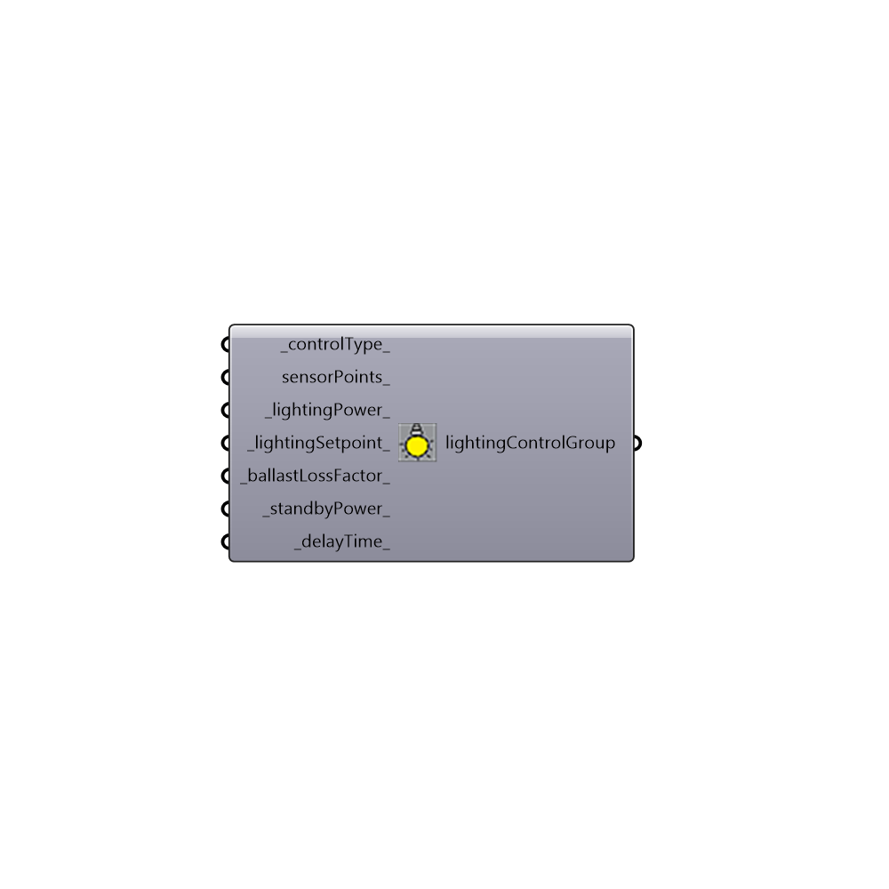

##  Lighting control Recipe - [[source code]](https://github.com/ladybug-tools/honeybee-legacy/tree/master/src/Honeybee_Lighting%20control%20Recipe.py)

Daysim electrical lighting control. Check this link for more information about lighting control types. http://daysim.ning.com/page/keyword-lighting-control
 -
 

#### Inputs
* ##### controlType [Default]
Lighting controlType: [0] Manual on/off switch, [1] Automate switch off occupancy sensor, [2] Always on during active occupancy hours, [3] Manual On/off with auto Dimming [4] Auto dimming with swith off occupancy sensor [5] Always on during active occupancy hours with auto dimming
* ##### sensorPoints [Optional]
Selected list of test points that indicates where lighting sensor points are located.
* ##### lightingPower [Default]
 Lighting power in watts. Default is 250 w.
* ##### lightingSetpoint [Default]
Target illuminance for the space. Default is 300 lux.
* ##### ballastLossFactor [Default]
Minimum electric dimming level in percentages.
* ##### standbyPower [Default]
Standby power in watts. Default is 3 w.
* ##### delayTime [Default]
Switch-off delay time in minutes. Default is 5 minutes.

#### Outputs
* ##### lightingControlGroup
Lighting control Recipe

[Check Hydra Example Files for Lighting control Recipe](https://hydrashare.github.io/hydra/index.html?keywords=Honeybee_Lighting control Recipe)