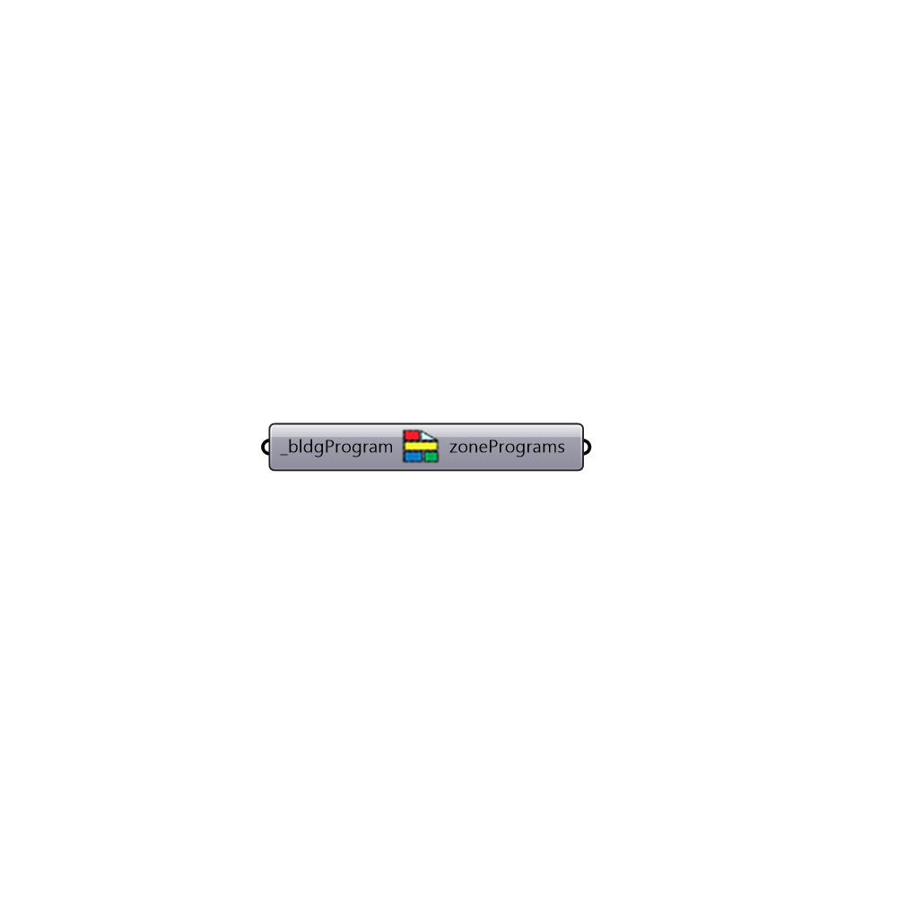

##  ListZonePrograms - [[source code]](https://github.com/ladybug-tools/honeybee-legacy/tree/master/src/Honeybee_ListZonePrograms.py)

Find list of spaces for each space based on program
 -
 

#### Inputs
* ##### bldgProgram [Required]
An index number for 

#### Outputs
* ##### zonePrograms
Honeybee zones in case of success

[Check Hydra Example Files for ListZonePrograms](https://hydrashare.github.io/hydra/index.html?keywords=Honeybee_ListZonePrograms)