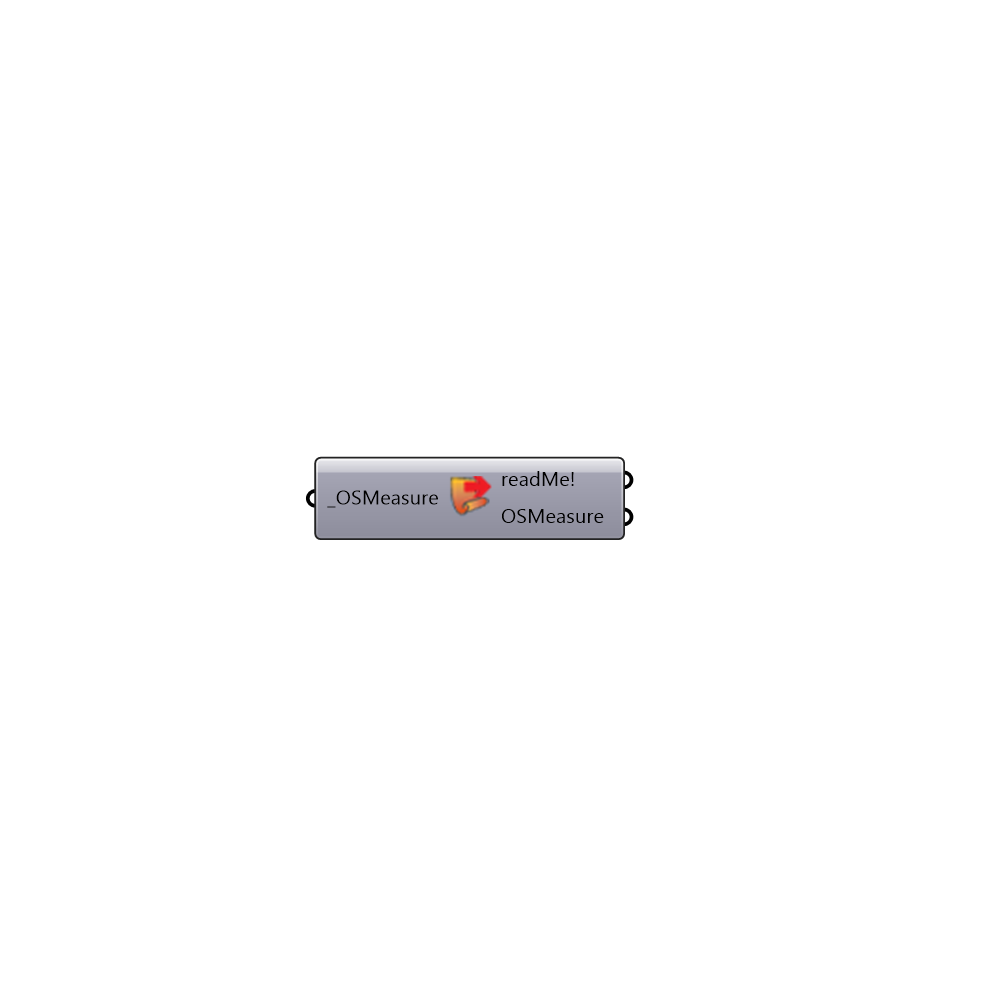

##  Load OpenStudio Measure - [[source code]](https://github.com/ladybug-tools/honeybee-legacy/tree/master/src/Honeybee_Load%20OpenStudio%20Measure.py)

This component loads OpenStudio measureds into Honeybee. The measure can be applied to an OpenStudio model.
 Read more about OpenStudio measures here: http://nrel.github.io/OpenStudio-user-documentation/reference/measure_writing_guide/
 You can download several measures from here: https://bcl.nrel.gov/nrel/types/measure
 -
 

#### Inputs
* ##### OSMeasure [Required]
Path to measure directory [NOT THE FILE]. This input will be removed once measure is loaded

#### Outputs
* ##### readMe!
The execution information, as output and error streams
* ##### OSMeasure
Loaded OpenStudio measure

[Check Hydra Example Files for Load OpenStudio Measure](https://hydrashare.github.io/hydra/index.html?keywords=Honeybee_Load OpenStudio Measure)