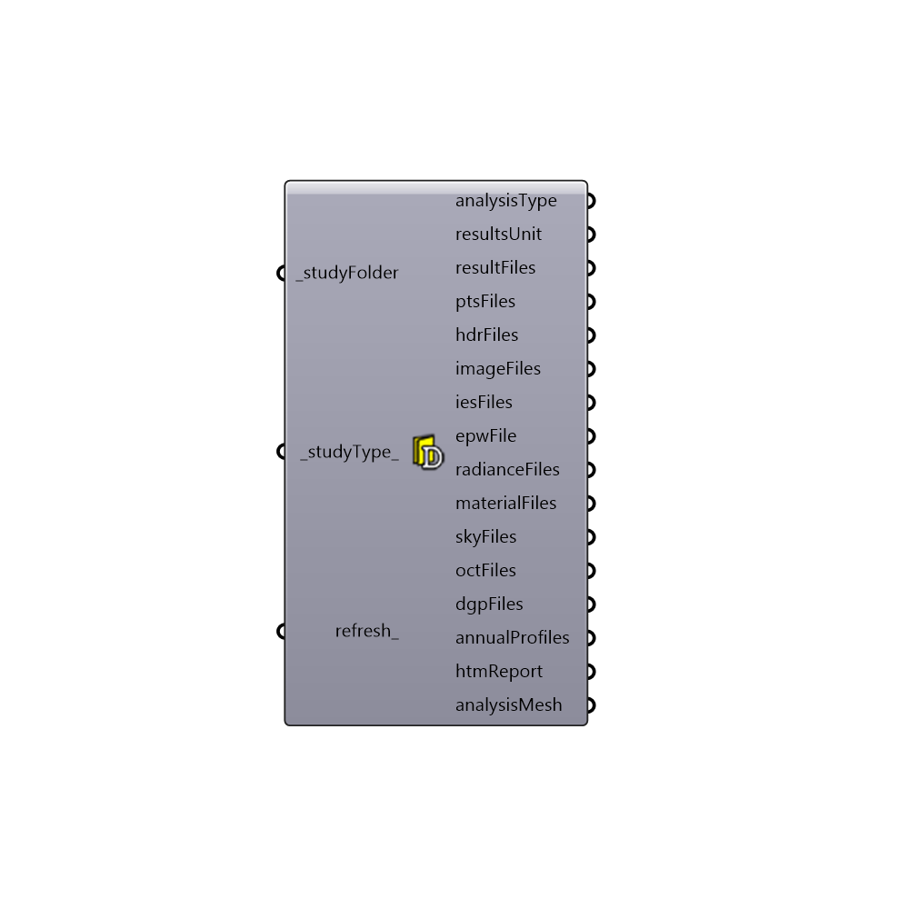

##  Lookup Daylighting Folder

Search Simulation Folder
 -
 

#### Inputs
* ##### studyFolder [Required]
Path to base study folder. If _studyType is empty then it should be full path to study folder
* ##### studyType [Default]
Optional input for Honeybee study type
 1 > imageBasedSimulation
 2 > gridBasedSimulation
 3 > DF
 4 > VSC
 5 > annualSimulation
* ##### refresh [Optional]
Refresh

#### Outputs
* ##### analysisType
Type of the analysis (e.g. illuminance, luminance,...)
* ##### resultsUnit
Unit of the results (e.g. lux, candela, wh/m2)
* ##### illFiles
List of ill files from annual analysis
* ##### ptsFiles
List of point files
* ##### hdrFiles
List of hdr files
* ##### imageFiles
List of gif files
* ##### epwFile
Script variable searchAnnualSimulationFolder
* ##### radianceFiles
Script variable LookupFolder_Daylighting
* ##### materialFiles
Script variable LookupFolder_Daylighting
* ##### skyFiles
Script variable LookupFolder_Daylighting
* ##### octFiles
Script variable LookupFolder_Daylighting
* ##### dgpFiles
Script variable LookupFolder_Daylighting
* ##### annualProfiles
A .csv file generated by Daysim that can be used as an schedule for annual daylight simulation
* ##### htmReport
Script variable LookupFolder_Daylighting
* ##### analysisMesh
Script variable LookupFolder_Daylighting

[Check Hydra Example Files for Lookup Daylighting Folder](https://hydrashare.github.io/hydra/index.html?keywords=Honeybee_Lookup Daylighting Folder)