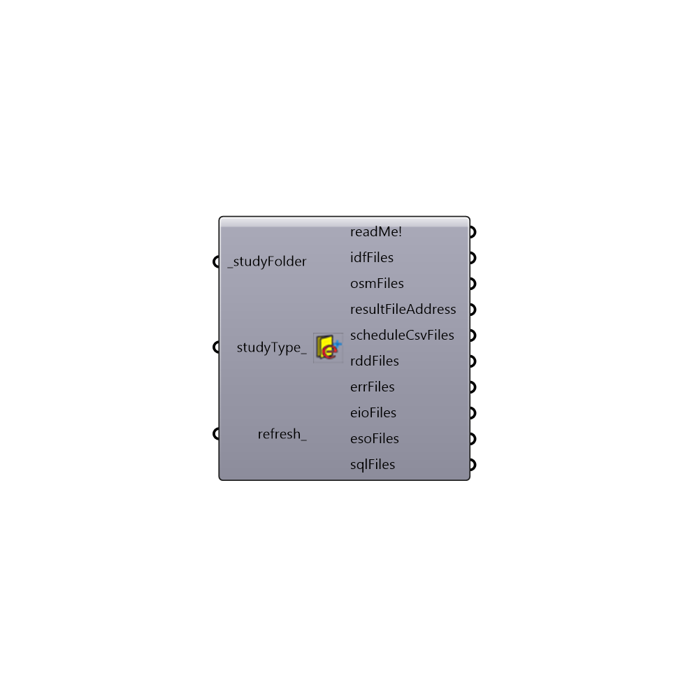

##  Lookup EnergyPlus Folder

Search Energy Simulation Folder
 -
 

#### Inputs
* ##### studyFolder [Required]
Path to base study folder. It can be a single simulation folder or a folder containing subfolders produced by parametric simulations
* ##### studyType [Optional]
Input for Honeybee EnergyPlus study type:
 1 > Energy Plus
 2 > OpenStudio
* ##### refresh [Optional]
Refresh

#### Outputs
* ##### readMe!
The execution information, as output and error streams
* ##### idfFiles
Script variable Python
* ##### osmFiles
Script variable LookupFolder_EnergyPlus
* ##### resultFileAddress
Script variable Python
* ##### scheduleCsvFiles
Script variable Python
* ##### rddFiles
Script variable Python
* ##### errFiles
Script variable Python
* ##### eioFiles
Script variable Python
* ##### esoFiles
Script variable Python
* ##### sqlFiles
Script variable Python

[Check Hydra Example Files for Lookup EnergyPlus Folder](https://hydrashare.github.io/hydra/index.html?keywords=Honeybee_Lookup EnergyPlus Folder)