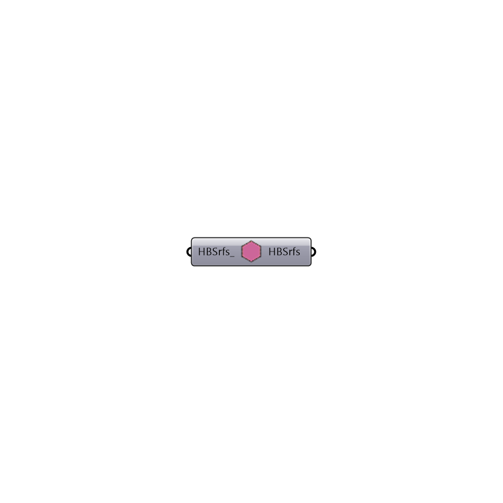

##  Make Adiabatic - [[source code]](https://github.com/mostaphaRoudsari/honeybee/tree/master/src/Honeybee_Make%20Adiabatic.py)

Make Adiabatic
 -
 

#### Inputs
* ##### HBSrfs [Optional]
A list of valid Honeybee surfaces

#### Outputs
* ##### HBSrfs
Modified list of Honeybee surfaces with 

[Check Hydra Example Files for Make Adiabatic](https://hydrashare.github.io/hydra/index.html?keywords=Honeybee_Make Adiabatic)