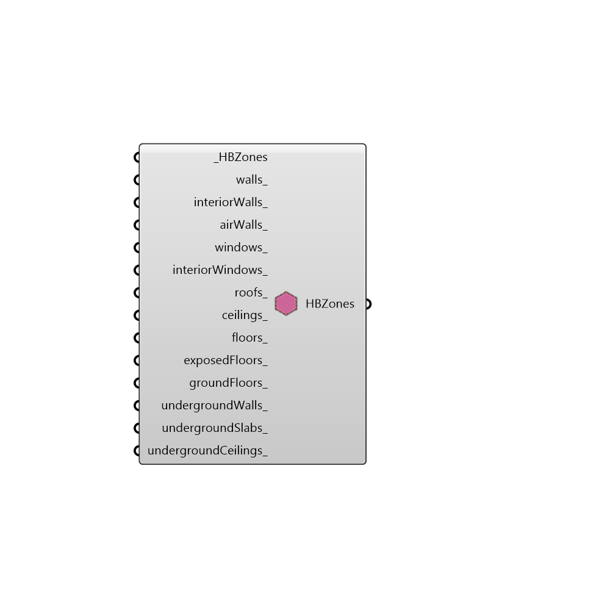

##  Make Adiabatic By Type - [[source code]](https://github.com/mostaphaRoudsari/honeybee/tree/master/src/Honeybee_Make%20Adiabatic%20By%20Type.py)

Use this component to make certain surface types of a zone adiabatic.
 -
 

#### Inputs
* ##### HBZones [Required]
HBZones for which some surface types will be turned to adiabatic.
* ##### walls [Optional]
Set to 'True' to have this surface type turned adiabatic. This input can also accept lists of boolean values and will assign different adiabatic values based on cardinal direction, starting with north and moving counter-clockwise.
* ##### interiorWalls [Optional]
Set to 'True' to have this surface type turned adiabatic.
* ##### airWalls [Optional]
Set to 'True' to have this surface type turned adiabatic.
* ##### windows [Optional]
Set to 'True' to have this surface type turned adiabatic.
* ##### interiorWindows [Optional]
Set to 'True' to have this surface type turned adiabatic.
* ##### roofs [Optional]
Set to 'True' to have this surface type turned adiabatic.
* ##### ceilings [Optional]
Set to 'True' to have this surface type turned adiabatic.
* ##### floors [Optional]
Set to 'True' to have this surface type turned adiabatic.
* ##### exposedFloors [Optional]
Set to 'True' to have this surface type turned adiabatic.
* ##### groundFloors [Optional]
Set to 'True' to have this surface type turned adiabatic.
* ##### undergroundWalls [Optional]
Set to 'True' to have this surface type turned adiabatic.
* ##### undergroundSlabs [Optional]
Set to 'True' to have this surface type turned adiabatic.
* ##### undergroundCeilings [Optional]
Set to 'True' to have this surface type turned adiabatic.

#### Outputs
* ##### HBZones
Modified HBZones with their surfaces made adiabatic that have a 'True' boolean connected to this component.

[Check Hydra Example Files for Make Adiabatic By Type](https://hydrashare.github.io/hydra/index.html?keywords=Honeybee_Make Adiabatic By Type)