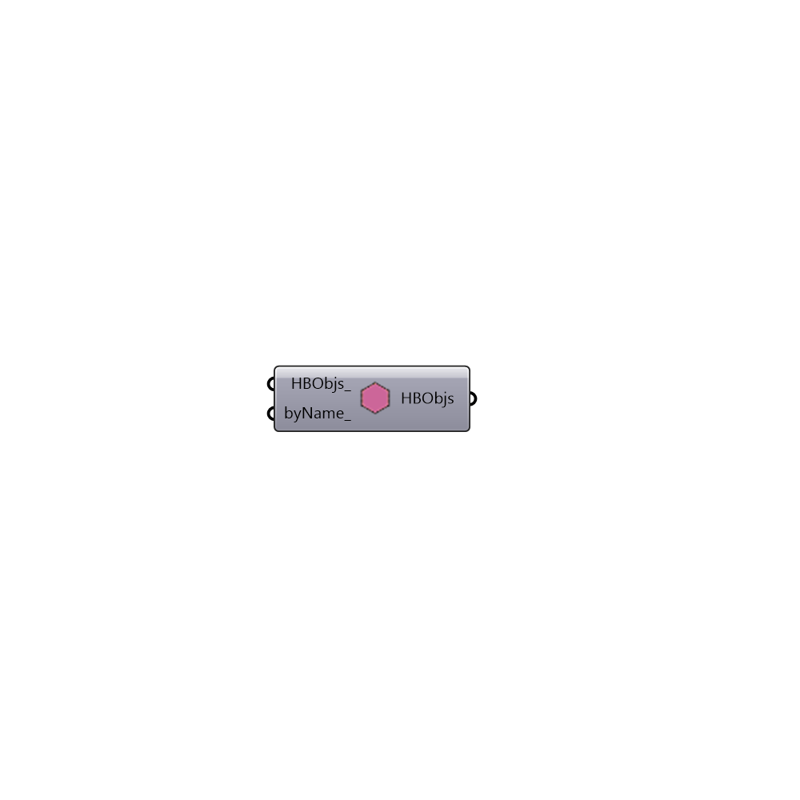

##  Make Adiabatic by Name - [[source code]](https://github.com/mostaphaRoudsari/honeybee/tree/master/src/Honeybee_Make%20Adiabatic%20by%20Name.py)

Make Adiabatic
 -
 

#### Inputs
* ##### HBObjs [Optional]
A list of valid Honeybee surfaces
* ##### byName [Optional]
A list of valid surface names

#### Outputs
* ##### HBObjs
Modified list of Honeybee surfaces with 

[Check Hydra Example Files for Make Adiabatic by Name](https://hydrashare.github.io/hydra/index.html?keywords=Honeybee_Make Adiabatic by Name)