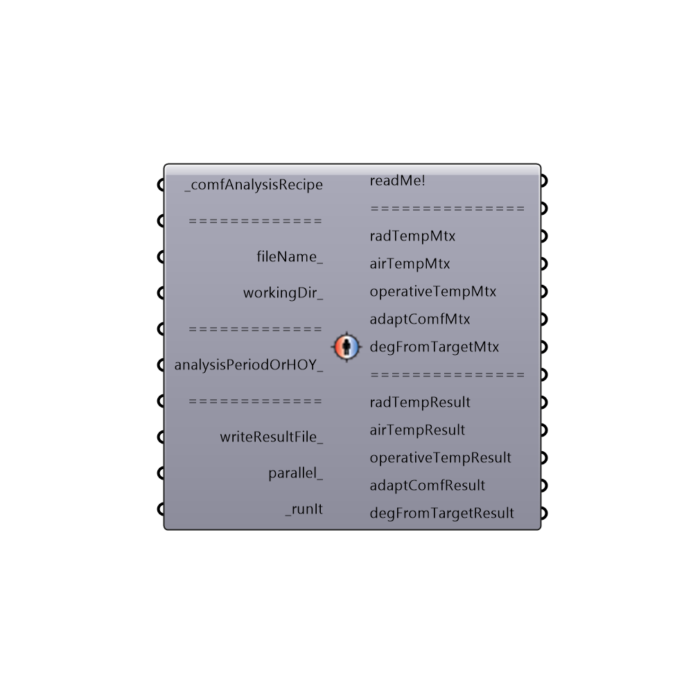

##  Microclimate Map Analysis - [[source code]](https://github.com/mostaphaRoudsari/honeybee/tree/master/src/Honeybee_Microclimate%20Map%20Analysis.py)

Use this component runs an annual comfort assessment off of EnergyPlus results and write all values into csv files.
 The results in these files can be used for creating indoor comfort maps.
 -
 

#### Inputs
* ##### comfAnalysisRecipe [Required]
A comfort analysis recipe out of one of the comfort recipe component.
* ##### fileName [Optional]
An optional file name for the result files as a string.
* ##### workingDir [Optional]
An optional working directory on your system. Default is set to C:\Ladybug
* ##### analysisPeriodOrHOY [Optional]
An analysis period from the 'Ladybug Analysis Period' component or an hour of the analysis between 1 and 8760 for which you want to conduct the analysis. If no value is connected here, the component will run for only noon on the winter solstice.  A single HOY is used by default as longer analysis periods can take a very long time.
* ##### writeResultFile [Optional]
Set to 1 or 'True' to have the component write all results into CSV result files and set to 0 or 'False' to not have the component write these files.  The default is set to 'True' as these simulations can be long and you usually want a copy of your results.  You may want to set it to 'False' if you are just scrolling through key hours and want the fastest run possible.  Set to 2 if you want the component to only write the results of the last two matrices (comfort results and degFromTarget).
* ##### parallel [Optional]
Set to "True" to run the component using multiple CPUs.  This can dramatically decrease calculation time but can interfere with other intense computational processes that might be running on your machine.  For this reason, the default is set to 'False.'
* ##### runIt [Required]
Set boolean to "True" to run the component and generate files for an annual indoor comfort assessment.

#### Outputs
* ##### readMe!
...
* ##### radTempMtx
A python matrix containing MRT data for every hour of the analysis to be plugged into the 'Honeybee_Visualize Annual Comfort Results' component.
* ##### airTempMtx
A python matrix containing air temperature data for every hour of the analysis to be plugged into the 'Honeybee_Visualize Annual Comfort Results' component.
* ##### operativeTempMtx
A python matrix containing operative temperature data for every hour of the analysis to be plugged into the 'Honeybee_Visualize Annual Comfort Results' component.
* ##### adaptComfMtx
A python matrix containing adaptive comfort data for every hour of the analysis to be plugged into the 'Honeybee_Visualize Annual Comfort Results' component.
* ##### degFromTargetMtx
A python matrix containing degrees from tartget temperature data for every hour of the analysis to be plugged into the 'Honeybee_Visualize Annual Comfort Results' component.
* ##### radTempResult
A csv file address containing the radiant temperature resultsfor each point for every hour of the analysis.
* ##### airTempResult
A csv file address containing the air temperature results for each point for every hour of the analysis.
* ##### operativeTempResult
A csv file address containing the operative temperature results for each point for every hour of the analysis.
* ##### adaptComfResult
A csv file address containing the a series of 0's and 1's indicating whether a certain point is comfortable for every hour of the analysis.
* ##### degFromTargetResult
A csv file address containing the a series of numbers indicating the degrees that a certain point is from the neutral temperature for every hour of the analysis.

[Check Hydra Example Files for Microclimate Map Analysis](https://hydrashare.github.io/hydra/index.html?keywords=Honeybee_Microclimate Map Analysis)