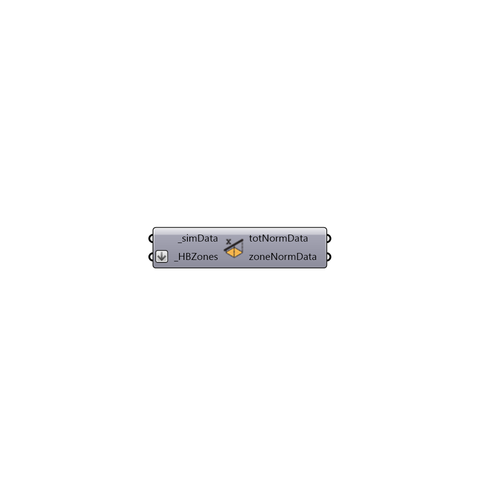

##  Normalize Data by Floor Area

This component takes data that has been output from a simulation and normalizes the results by the floor area of the HBZones.
 -
 

#### Inputs
* ##### simData [Required]
Results from one of the Read Result components.
* ##### HBZones [Required]
Script variable Python

#### Outputs
* ##### totNormData
The results normalized by the floor area of all connected HBZones.
* ##### zoneNormData
The results normalized by the floor area of each of the connected HBZones.  Note that this will not be output is the connected data is not for the individual zones.

[Check Hydra Example Files for Normalize Data by Floor Area](https://hydrashare.github.io/hydra/index.html?keywords=Honeybee_Normalize Data by Floor Area)