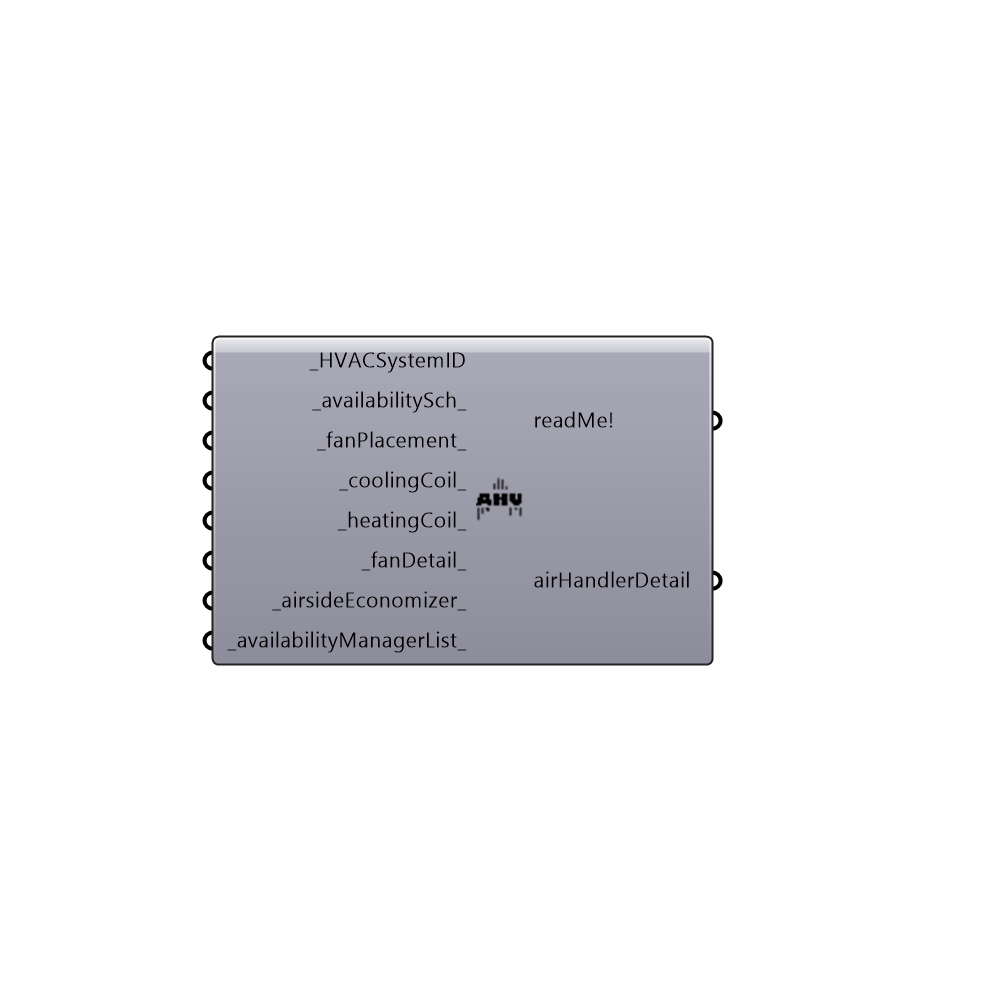

##  OpenStudio Air Handler Detail

OpenStudio Systems
 -
 

#### Inputs
* ##### HVACSystemID [Required]
... use of the integers representing a system, as found in openStudioHVACSystemsList
* ##### availabilitySch [Default]
... a Honeybee or OpenStudio schedule reference.
* ##### fanPlacement [Default]
... BlowThrough or DrawThrough.
* ##### coolingCoil [Default]
... Provide a definition fo a cooling coil (from the Honeybee component for cooling coils).  This component currently accepts one and two speed DX coil
* ##### heatingCoil [Default]
... Provide a definition fo a heating coil (from the Honeybee component for heating coils).  This component currently does not accept heating coils
* ##### fanDetail [Default]
... Provide a definition for a fan serving your air handler(s) .  This component current accepts constant volume fans that ride the fan curve, or a VFD fan
* ##### airsideEconomizer [Default]
... Provide a definition of 5an airside economizer (from the Honeybee component with the same name.
* ##### availabilityManagerList [Default]
...Provide the output of an availability manager list component to override OpenStudio default behavior.  Do nothing and the fan system never shuts off, which is not really desired behavior.

#### Outputs
* ##### readMe!
The execution information, as output and error streams
* ##### airHandlerDetail
Script variable Python

[Check Hydra Example Files for OpenStudio Air Handler Detail](https://hydrashare.github.io/hydra/index.html?keywords=Honeybee_OpenStudio Air Handler Detail)