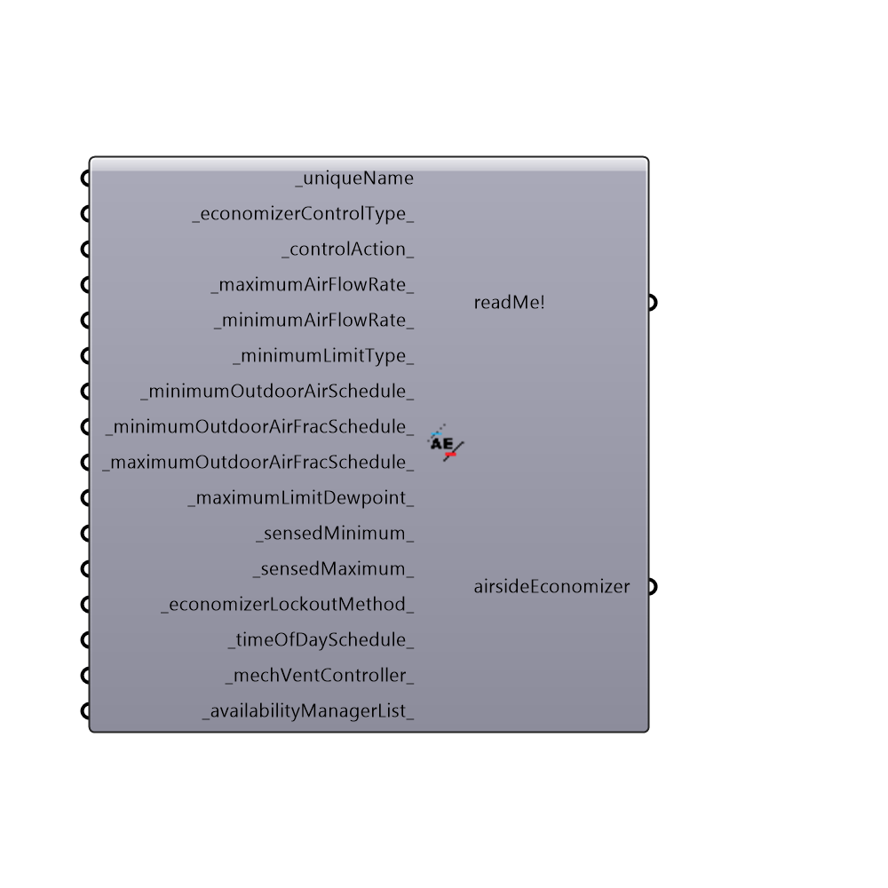

##  OpenStudio Airside Economizer Detail

Airside Economizer
 -
 

#### Inputs
* ##### uniqueName [Required]
a required field to uniquely name the economizer
* ##### economizerControlType [Default]
... requires an integer specifying the type of economizer 0:FixedDryBulb(default),1:DifferentialDryBulb,2:FixedEnthalpy,3:DifferentialEnthalpy,4:ElectronicEnthalpy,5:FixedDewPointAndDryBulb,6:DifferentialDryBulbAndEnthalpy,7:NoEconomizer
* ##### controlAction [Default]
... Requires an integer.  See ecdict for different values to supply.  Supply nothing and it defaults to "ModulateFlow"
* ##### maximumAirFlowRate [Default]
... supply nothing and it will Autosize (recommended)
* ##### minimumAirFlowRate [Default]
... do nothing and it will Autosize (recommended)
* ##### minimumLimitType [Default]
... do nothing and it defaults to Proportional Minimum (min depends on the supply air flow rate as opposed to an absolute number)
* ##### minimumOutdoorAirSchedule [Default]
... This is a schedule with values between 0 and 1, and it is multiplied by the minimumAirFlowRate.  It is usually left blank, but can be used to fine tune the economizer during warm-up time or after hours.
* ##### minimumOutdoorAirFracSchedule [Default]
... this overrides minOutdoorAirSchedule and minAirflowRate.  It is a schedule between 0 and 1.  It is often used to create a 100% outside air system.
* ##### maximumOutdoorAirFracSchedule [Default]
... this is a schedule between 0 and 1.  It is often used to create a recirculating outside air system such as that in patient rooms.
* ##### maximumLimitDewpoint [Default]
... needed for when the ControlType is Fixed Dewpoint and Dry Bulb.  Otherwise leave blank
* ##### sensedMinimum [Default]
... is the minimum of whatever the control type, at this point the system goes to minimum flow
* ##### sensedMaximum [Default]
... is the maximum of whatever the control type, at this point the system goes to minimum flow
* ##### economizerLockoutMethod [Default]
... should only used when the HVAC system is packaged DX
* ##### timeOfDaySchedule [Default]
this field is only used when the outdoor flow rate is based on a schedule.  It is rare for a normal economizer to have this value set.  If so, apply the name of a schedule.
* ##### mechVentController [Default]
an optional field, though highly recommended.  Open Studio provides default behavoir for this controller.
* ##### availabilityManagerList [Default]
allows you to toggle between different AvailabilityManagers.  Right now, we simply allow you to create a list that has only one AvailabilityManager, and the type of manager can be ScheduledOrNightCycle

#### Outputs
* ##### readMe!
The execution information, as output and error streams
* ##### airsideEconomizer
An airside economizer detail that can be plugged into the "Honeybee_Air Handling Unit Detail" component.

[Check Hydra Example Files for OpenStudio Airside Economizer Detail](https://hydrashare.github.io/hydra/index.html?keywords=Honeybee_OpenStudio Airside Economizer Detail)