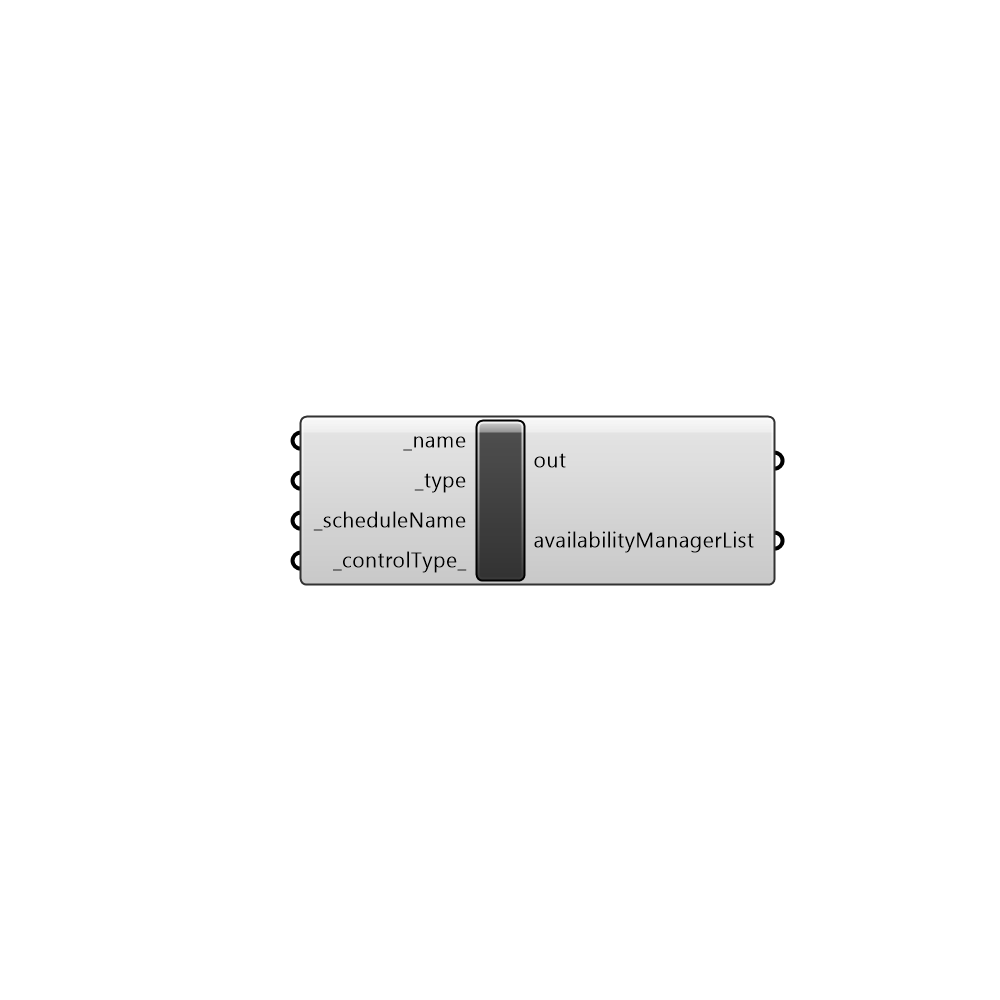

##  OpenStudio Availability Manager List

AvailabilityManagerList
 -
 

#### Inputs
* ##### name [Required]
... provide a unique name for this manager list (required)
* ##### type [Required]
... there are two options currently available for AvailabilityManager types, 0 = Scheduled and 1 = NightCycle. (required)
* ##### scheduleName [Required]
... both types of AvailabilityManager require a schedule.  Just provide a schedule name available from Honeybee.  This schedule will determine whether the manager is available for control.  By default, if left blank (recommended) the schedule will be Always On (always available).  This is what most people want.
* ##### controlType [Default]
... an optional field for NightCycle type AvailabilityManagers only.  It will be ignored for type Scheduled.  There are two options 0: StayOff and 1:CycleOnAny (the default).  If left blank, it will default (this is usually what is preferred, so leave it blank if you are not sure)

#### Outputs
* ##### readMe!
The execution information, as output and error streams
* ##### availabilityManagerList
...returns an object that will modify the availability manager

[Check Hydra Example Files for OpenStudio Availability Manager List](https://hydrashare.github.io/hydra/index.html?keywords=Honeybee_OpenStudio Availability Manager List)