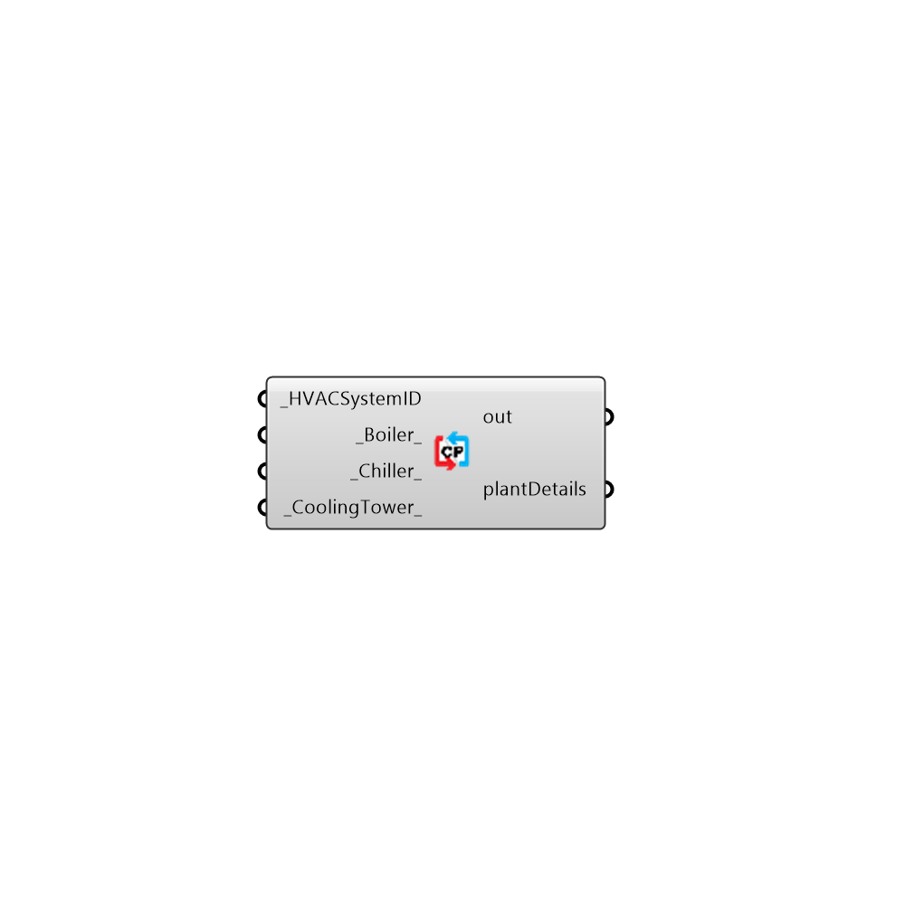

##  OpenStudio Central Plant Orchestrator

EPlus Plantside Organizer
 -
 

#### Inputs
* ##### HVACSystemID [Required]
Script variable EPlusCentralPlant
* ##### Boiler [Default]
Script variable Python
* ##### Chiller [Default]
Script variable Python
* ##### CoolingTower [Default]
Script variable EPlusCentralPlant

#### Outputs
* ##### out
The execution information, as output and error streams
* ##### plantDetails
Script variable Python

[Check Hydra Example Files for OpenStudio Central Plant Orchestrator](https://hydrashare.github.io/hydra/index.html?keywords=Honeybee_OpenStudio Central Plant Orchestrator)