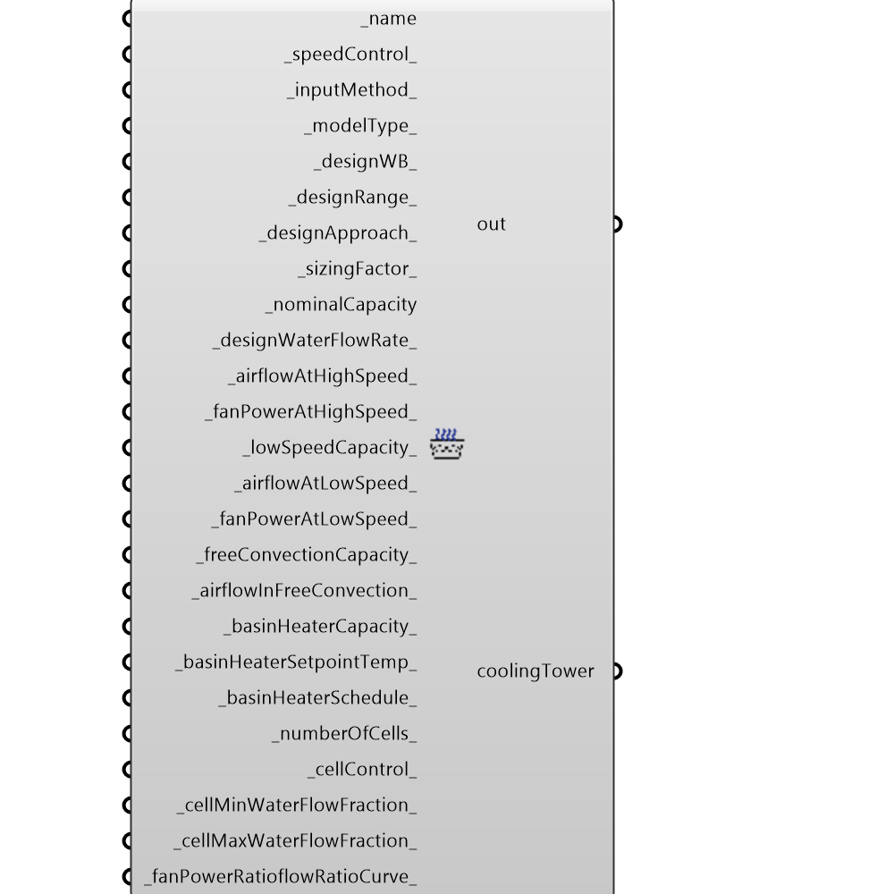

##  OpenStudio Cooling Tower

EPlus Cooling Tower
 -
 

#### Inputs
* ##### name [Required]
Script variable Python
* ##### speedControl [Default]
an integer that defines the speed control of the cooling tower 1:1-speed, 2:2-speed (default if left blank), 3:variable speed
* ##### inputMethod [Default]
an integer that defines how the cooling Tower performance is entered.  0:UFactorTimesAreaAndDesignWaterFlowRate (honeybee default if left blank) , 1:NominalCapacity
* ##### modelType [Default]
used only for Variable Speed towers, an input that defines the empirical model used for the cooling tower.  Provide an integer for 0:"CoolToolsCrossFlow" (default if left blank) or 1:"YorkCalc"
* ##### designWB [Default]
used only for Variable Speed towers, an input in deg Celsius, that indicates the outdoor wet bulb at design conditions.  If left blank, the default is 25.5556 degrees Celsius (78 degrees Fahrenheit).  Minimum is 20 degrees C
* ##### designRange [Default]
used only for Variable Speed towers, an input in deg Celsius, that indicates the difference in temperature between the water entering and leaving the tower.  If left blank, the default is 5.5556 degrees Celsius (10 degrees Celsius). Must be greater than 0.
* ##### designApproach [Default]
used only for Variable Speed towers, an input in deg Celsius, that indicates how close the leaving water temperature comes to the outdoor dry bulb (it will always be greater than the outdoor dry bulb).  If left blank, the default is 3.8889 degrees Celsius (7 degrees Fahrenheit).  Must be greater than o
* ##### sizingFactor [Default]
an optional field that allows a user to specify a sizing factor for the peak load when all components are autosized.  The default if left blank is 1.15 (recommended).  Variables affected by the sizing factor can be found in the EnergyPlus documentation.
* ##### nominalCapacity [Required]
the nominal capacity at highest speed (in Watts) of the cooling tower assuming 95-85F leaving/entering water temperature, air at 78F WB, 95F DB, with design water flow rate at 3 GPM/ton.  If left blank, it autosizes
* ##### designWaterFlowRate [Default]
if the input method is 0 (UFactorTimesAreaAndDesignWaterFlowRate) then this is required (value is in cubic meters per second.  If left blank, this can be autosized based on
* ##### airflowAtHighSpeed [Default]
the tower airflow rate at high speed in cubic meters per second. If this is left blank, this field will be autosized (recommended).  The airflow rate assumes 190 Pascals of fan pressure rise an 0.5 total fan efficiency
* ##### fanPowerAtHighSpeed [Default]
the fan power at high airflow rate (in Watts).  If left blank, the fan power autosized (recommended) where the power is 0.0105 times the Tower's High Speed Capacity.
* ##### lowSpeedCapacity [Default]
the capacity at low fan speed (in Watts) of the cooling tower under same operating conditions as above.  This field will be ignored if the speed is not two-speed.
* ##### airflowAtLowSpeed [Default]
the flow rate in m3/s of the tower flow rate at low speed.  If left blank, it autosized (recommended) where the airflow rate is 50% of the airflow at high speed.  The airflow entered must be less than the airflow rate at high speed.
* ##### fanPowerAtLowSpeed [Default]
the fan power, (in Watts) at the low-speed airflow rate.  It can be autosized (recommended) where the fan power is set to 16% of the high speed fan power.
* ##### freeConvectionCapacity [Default]
the capacity of the cooling tower with no fans (in Watts).  If free convection mode is not modeled, then this field should be set to zero. 
* ##### airflowInFreeConvection [Default]
the airflow in cubic meters per second through the tower when no fans are on.  If left blank, it can autosize.  If inputMethod=0, honeybee will assume it defaults to 0, if inputMethod=1, the airflow rate is 10% of the airFlowRate at high speed.
* ##### basinHeaterCapacity [Default]
the capaity (in Watts) of a basin heater that comes on to prevent freezing of the basin water.  If left blank, it will autosize to 0.  The heater only comes on when the fans are off, and the temperatre falls below the setpoint temperature
* ##### basinHeaterSetpointTemp [Default]
the setpoint temperature for the basin heater (in degrees C).  The heater is active when the outdoor dry bulb temperature falls below this temperature.  Temperature must be greater than 2 degrees C.  Default if blank is 2 degrees C.
* ##### basinHeaterSchedule [Default]
if left blank, it will default (recommended) to being "always available".  However this can be overridded to make it only available at certain times.
* ##### numberOfCells [Default]
an integer specifying the number of cells.  If left blank, the assumption is a single-celled cooling tower
* ##### cellControl [Default]
an integer that specifies one of two options:  0=MinimalCell OR 1=MaximalCell.  Option 0 runs as few cells as possible at maximum water flow rate, option 1 assumes maximum cells at minimum water flow rate
* ##### cellMinWaterFlowFraction [Default]
specifies the smallest fraction of the design water flow rate.  Flows less than this would result in fluid distribution problems in the tower.  By default, if left blank (recommended), the default value is 0.33
* ##### cellMaxWaterFlowFraction [Default]
specifies the allowable largest fraction of design water flow rate.  This field can be autosized, with a default value of 2.5 (recommended)
 [for future]_heatRejectionCapacityFactor_:  a decimal indicating the capacity of the cooling tower.  By default, the factor is 1.25 (assumes that 25% of the load is turned into compressor heat to be rejected)
 [for future]_designUFactorTimesArea: a value between 0 and 300,000 that defines, in Watts per Kelvin, the heat transfer effectiveness of the cooling Tower.  If inputType is NominalCapacity, this field will be ignored by honeybee.  Left for future because this field can be autosized.
 [for future]_freeConvAirflowFactor:  is a value that is a fraction of the autocalculated peak flow rate, that is the free convection flow rate of the tower.  Left for future because this field is set to 0.1 by EnergyPlus by default.
 [for future]_freeConvUFactorTimesArea:  a value that is a fraction of the designUFactorTimesArea.  Left for future because this field has defaults or is autosized. If inputType is NominalCapacity, this field will be ignored by honeybee.
 [for future]_freeConvNominalCapacityRatio:  a value that is a fraction of the Nominal capacity
 [for future]_evaporationLossMode_:  used to chose which method to model the amount of water evaporated by the cooling tower.  There are two options (LossFactor or SaturatedExit (the default used for now)
 [for future]_evaporationLossFactor_:  the rate of water evaporated from the cooling tower (percent per kelvin).  Only used if the lossMode is LossFactor.  The default if left blank is 0.2, with a range between 0.15 - 0.27
 [for future]_driftLossPercent_:  the rate of water lost to exiting air as entrained droplets (a percentage).  If left blank, it defaults to 0.008%, where towers with drift eliminators have avalues between 0.002% - 0.2%
 [for future]_blowDownCalculation_:  specifies which method is used to determine blowdown rates to prevent scaling.  Two options, ConcentrationRation or ScheduleRate with default already provided as ConcentrationRatio
 [for future]_blowDownConcentrationRatio_:  the ratio of solids in the blowdown water to solids in the make up water.  This field is used to adjust the rate of blowdown in the tower.  Default is 3, with values between 3 and 5 allowed.
 [for future]_blowdownMakeupSchedule_: a schedule that defines the amount of water (in m3/s) flushed from the basin periodically.  Only used if blowdown calc mode is ScheduledRate
 [for future]_storageTankName_:if specified, the tower will try and take all water from this unit before attempting to use the water mains
* ##### fanPowerRatioflowRatioCurve [Default]
Script variable EPlusCoolingTower

#### Outputs
* ##### out
The execution information, as output and error streams
* ##### coolingTower
Script variable Python

[Check Hydra Example Files for OpenStudio Cooling Tower](https://hydrashare.github.io/hydra/index.html?keywords=Honeybee_OpenStudio Cooling Tower)