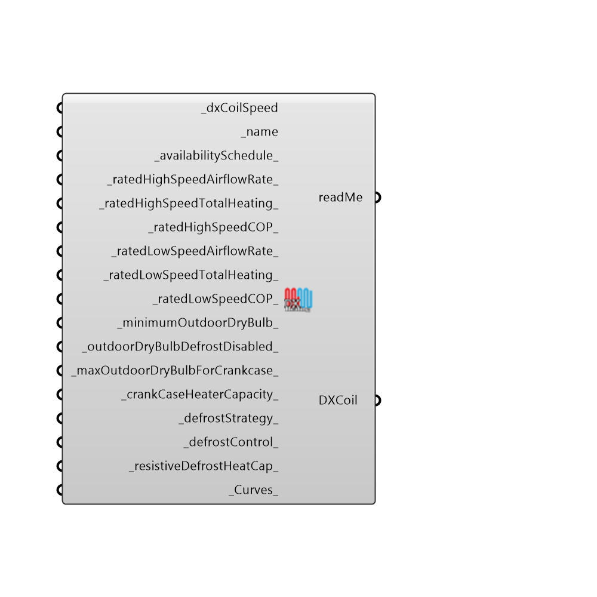

##  OpenStudio DX Heating Coil

EPlus DX Heating Coil
 -
 

#### Inputs
* ##### dxCoilSpeed [Required]
...0 = 1 speed, 1 = 2 speed
* ##### name [Required]
...provide a unique coil for each one that you use
* ##### availabilitySchedule [Default]
... an OpenStudio or Honeybee can be plugged in here to limit the availability of the cooling coil.
* ##### ratedHighSpeedAirflowRate [Default]
Script variable 2SpeedDXCoil
* ##### ratedHighSpeedTotalHeating [Default]
...This value is typically blank, it can be autosized (the Units are in Watts)/
* ##### ratedHighSpeedCOP [Default]
... the efficiency at design conditions for the DX coil
* ##### ratedLowSpeedAirflowRate [Default]
Script variable 2SpeedDXCoil
* ##### ratedLowSpeedTotalHeating [Default]
... This value is typically blank, it can be autosized (the Units are in Watts)/
* ##### ratedLowSpeedCOP [Default]
... the efficiency at design conditions for the DX coil
* ##### minimumOutdoorDryBulb [Default]
... If left blank, the default is -8C (17.6F) temperature when the compressor is shut off
* ##### outdoorDryBulbDefrostDisabled [Default]
... If left blank, the default is 5C (41F).  It is the temperature, below which, defrost is enabled to de-ice the heat source.
* ##### maxOutdoorDryBulbForCrankcase [Default]
... If left blank, the default is 10C (50F).  It is the temperature above which the compressor crankcase heater is disabled.
* ##### crankCaseHeaterCapacity [Default]
... If left blank, the default is zero.  It is the capacity of the compressor crankcase heater (Watts), which will turn on if below the stated temperature and the compressor is not running.
* ##### defrostStrategy [Default]
... If left blank, the default is 'ReverseCycle'.  Two options for this 'ReverseCycle', 'Resistive'.  Spelling must be correct.  It is the type of heating cycle used to melt frost accumulated on the outdoor coil.
* ##### defrostControl [Default]
... If left blank, the default is 'timed'.  Two options are 'timed' and 'on-demand'.
* ##### resistiveDefrostHeatCap [Default]
If left blank, the default in honeybee is zero.  It is the capacity in Watts of the resistive element used for defrost.
 _Curves_ ... Not yet implemented.  Allows you to specify custom part load curves for DX coils.
 _unitInternalStaticPressure_ ... (units are Pascals).  This item is rarely used, but helps to calculate EER and IEER for variable speed DX systems.  Refers to the total internal pressure of the air handler.
* ##### Curves [Default]
Script variable Python

#### Outputs
* ##### readMe
The execution information, as output and error streams
* ##### DXCoil
...return DX coil definition

[Check Hydra Example Files for OpenStudio DX Heating Coil](https://hydrashare.github.io/hydra/index.html?keywords=Honeybee_OpenStudio DX Heating Coil)