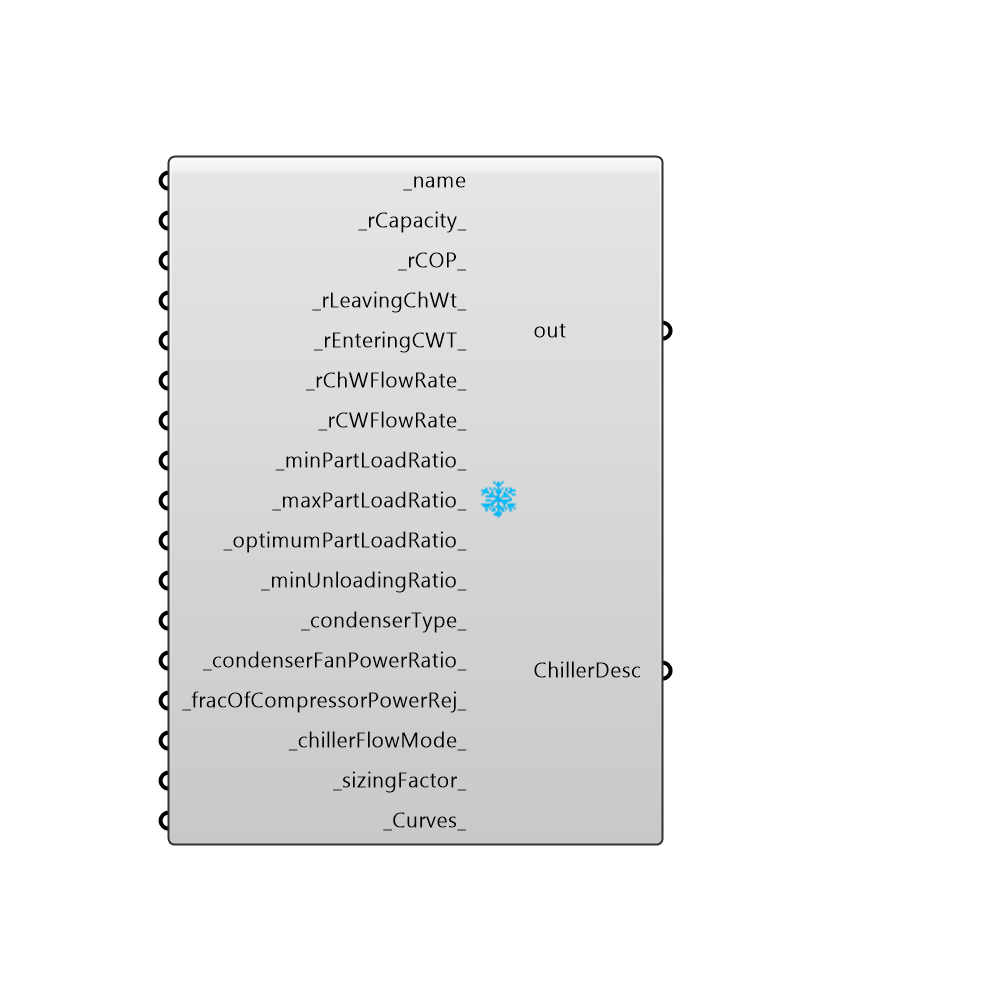

##  OpenStudio EIR Chiller

EPlus EIR Chiller
 -
 

#### Inputs
* ##### name [Required]
... provide a unique name for each chiller that you specify
* ##### rCapacity [Default]
....r=Reference condition chiller capacity (in Watts), if left blank, the capacity is autosized.
* ##### rCOP [Default]
...r=Reference COP at design conditions (includes energy of the copressor only)
* ##### rLeavingChWt [Default]
...r=Reference Leaving Chilled Water Temp (in degrees Celsius).  If left blank, the default temperature is 6.67 degrees Celsius.
* ##### rEnteringCWT [Default]
... r=Reference Leaving Condenser Water Temp (in degrees Celsius).  If left blank, the default temperature is 29.4 degrees Celsius
* ##### rChWFlowRate [Default]
... r=Reference Chilled Water Flow Rate (in Meters Cubed Per Second). If left blank, the default flow rate is autosized.
* ##### rCWFlowRate [Default]
... r=Reference Condenser Water Flow Rate (in Meters Cubed Per Second). If left blank, the default flow rate is autosized.
* ##### minPartLoadRatio [Default]
... the minimum part load ratio of the chiller.  If left blank, the default value is 0.1.  Range 0.05 <= minPLR <= 0.25
* ##### maxPartLoadRatio [Default]
...  the maximum part load ratio of the chiller.  If left blank, the default value is 1.0.  Range 1 <= maxPLR <= 1.2
* ##### optimumPartLoadRatio [Default]
... the optimum part load ratio of the chiller.  If left blank, the default value is 1.0.  Range 0.05 <= maxPLR <= 1.2. Must be >= min and <= max.
* ##### minUnloadingRatio [Default]
... The PLR at which the chiller has to be falsely loaded to meet the actual load (usually by hot gas bypass).  If left blank, default is 0.2.
* ##### condenserType [Default]
... 0=WaterCooled, 1=AirCooled, 2=EvaporativelyCooled.  If left blank, the condenser is WaterCooled.  Ratio of CondenserFanPower to Reference compressor power (W/W).
* ##### condenserFanPowerRatio [Default]
...  Used only when condenserType is AirCooled or EvaporativelyCooled.  Dimensionless ratio Watts of fan power per Watt of Cooling at Design Conditions
* ##### fracOfCompressorPowerRej [Default]
... If hermetic compressor, value should be 1.0 (the default).  If open compressor, the motor efficiency. 0.0<=frac<=1.0 
* ##### chillerFlowMode [Default]
... 0:NotModulated (default), 1:ConstantFlow (constant volume pumping system), 2:LeavingSetpointModulated (vary flow to match temp setpoint)
* ##### sizingFactor [Default]
use only when the capacities and flow rates are autosized.  Default is 1.0  1.0 <=sizingFactor<=1.3
* ##### Curves [Default]
... Not yet implemented.  Allows you to specify custom part load curves for chiller performance coils.

#### Outputs
* ##### out
The execution information, as output and error streams
* ##### ChillerDesc
...returns the chiller description

[Check Hydra Example Files for OpenStudio EIR Chiller](https://hydrashare.github.io/hydra/index.html?keywords=Honeybee_OpenStudio EIR Chiller)