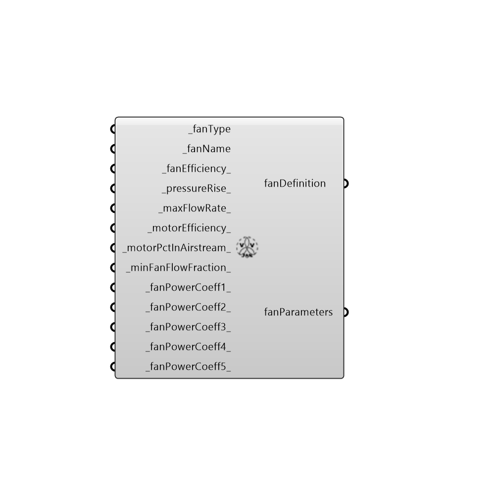

##  OpenStudio Fan Detail

Energy Plus Fan Definition
 -
 

#### Inputs
* ##### fanType [Required]
... 0 = Constant Volume, 1 = Variable Volume
* ##### fanName [Required]
... Provide a Unique name for the fan
* ##### fanEfficiency [Default]
... the fan blade mechanical efficiency, value must be between 0 and 1
* ##### pressureRise [Default]
... total static pressure of the fan, Pascals
* ##### maxFlowRate [Default]
... the peak flow rate of the fan, if left blank, this value autosizes
* ##### motorEfficiency [Default]
... the motor efficiency of the fan, value must be between 0 and 1
* ##### motorPctInAirstream [Default]
... percent of heat liberated by fan to the airstream, default is 100 percent
* ##### minFanFlowFraction [Default]
... the minimum airflow fraction of the fan, value must be between 0 and 1
* ##### fanPowerCoeff1 [Default]
... power curve coefficiencts for Variable Volume Fans
* ##### fanPowerCoeff2 [Default]
... power curve coefficiencts for Variable Volume Fans
* ##### fanPowerCoeff3 [Default]
... power curve coefficiencts for Variable Volume Fans
* ##### fanPowerCoeff4 [Default]
... power curve coefficiencts for Variable Volume Fans
* ##### fanPowerCoeff5 [Default]
... power curve coefficiencts for Variable Volume Fans

#### Outputs
* ##### fanDefinition
... updated fan definition returned by this component
* ##### fanParameters
Script variable ConstantVolumeFan

[Check Hydra Example Files for OpenStudio Fan Detail](https://hydrashare.github.io/hydra/index.html?keywords=Honeybee_OpenStudio Fan Detail)