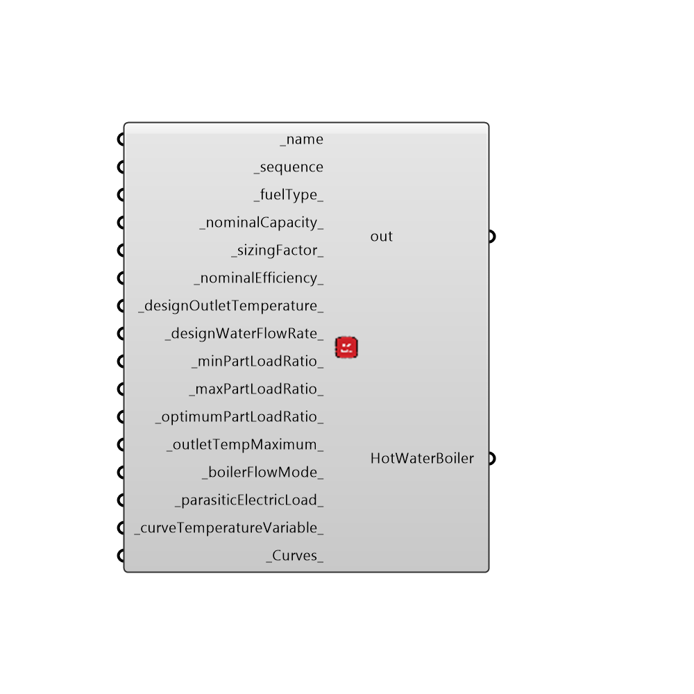

##  OpenStudio Hot Water Boiler

EPlus Hot Water Boiler
 -
 

#### Inputs
* ##### name [Required]
... provide a unique name for each boiler that you specify
* ##### sequence [Required]
...is a placeholder now (defaulted always to zero.  should allow users to create multiple boilers and assign sequencing capabilities.  Must be an integer, including zero.
* ##### fuelType [Default]
... Leave blank and the default is NaturalGas.  Choices are 0=Electricity, 1=NaturalGas, 2=PropaneGas, 3=FuelOil#1, 4=FuelOil#2, 5=Coal, 6=Diesel, 7=Gasoline, 8=OtherFuel1, 9=OtherFuel2
* ##### nominalCapacity [Default]
...If left blank, a boiler will be autosized.  However, entering a value allows the capacity to be user-defined, (the Units are in Watts).
* ##### sizingFactor [Default]
... a dimensionless number that will be multiplied by the capacity and the design water flow rate.  Usually will be something like "1.1" (a 10% increase).
* ##### nominalEfficiency [Default]
... The thermal capacity of the boiler.  A value between 0 and 1.
* ##### designOutletTemperature [Default]
... If left blank?, otherwise enter a value to specify the leaving temp at design, in Celsius
* ##### designWaterFlowRate [Default]
... If left blank ?, the water flow rate will autosize.  Otherwise enter a value to specify the design water flow rate (units are meters cubed per second) 
* ##### minPartLoadRatio [Default]
... Specify a value for the boiler turndown.
* ##### maxPartLoadRatio [Default]
...  Specify a value for the max boiler capacity (cannot exceed 1.1)
* ##### optimumPartLoadRatio [Default]
... Specify a value for the ideal operating part load ration (between min and max part load ratio)
* ##### outletTempMaximum [Default]
... If left blank, the value is 99 degrees Celsius.  Otherwise provide your own value for the maximum temperature out of the boiler.  This value cannot exceed 99.
* ##### boilerFlowMode [Default]
... The default, if not specified, is "NotModulated".  However, there are three available choices.  "NotModulated", "ConstantFlow", and "LeavingSetpointModulated"
* ##### parasiticElectricLoad [Default]
...  The default, if not specified, is 0 (zero).  Provide a value to indicate, in Watts, how much parasitic power is consumed by the boiler by controls, fans, or pumps integral to the boiler.
* ##### curveTemperatureVariable [Default]
... There are two options: "EnteringBoiler" and "LeavingBoiler".  This value is used to control which value of hot water to use when evaluating efficiency curves (if provided).
 _Curves_ ... Not yet implemented.  Allows you to specify custom part load curves for DX coils.
* ##### Curves [Default]
Script variable Python

#### Outputs
* ##### out
The execution information, as output and error streams
* ##### HotWaterBoiler
...returns the hot water boiler description

[Check Hydra Example Files for OpenStudio Hot Water Boiler](https://hydrashare.github.io/hydra/index.html?keywords=Honeybee_OpenStudio Hot Water Boiler)